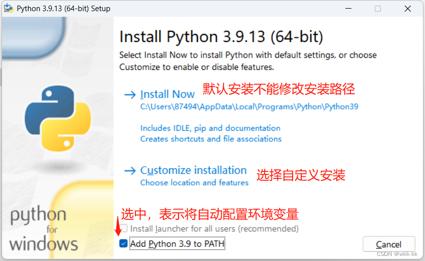
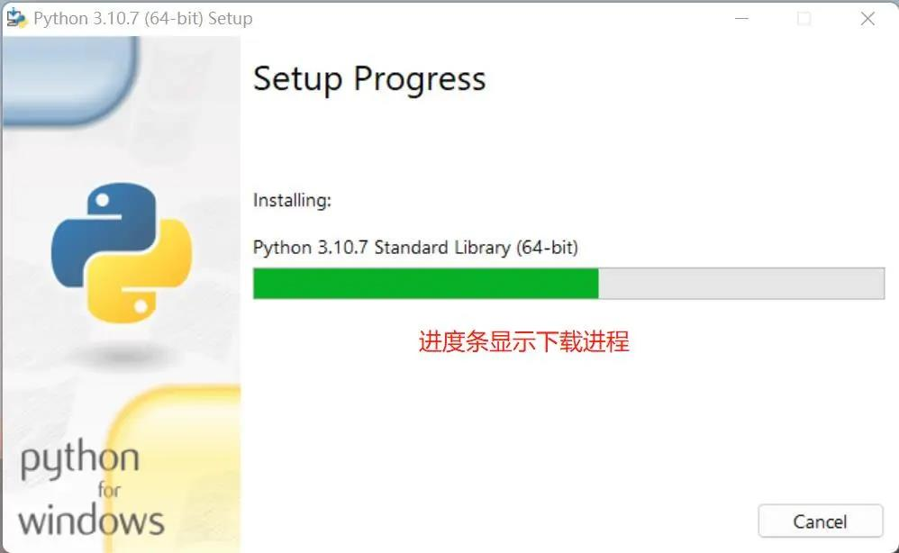
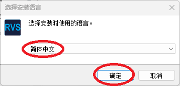
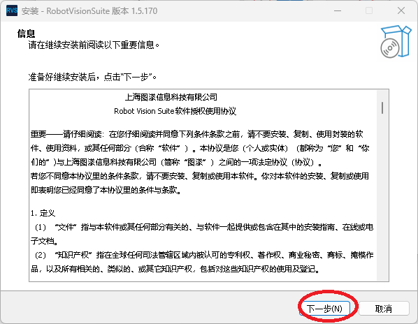
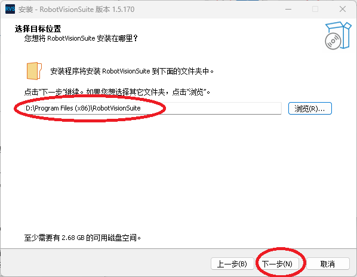
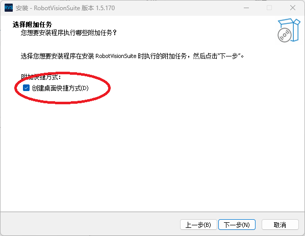
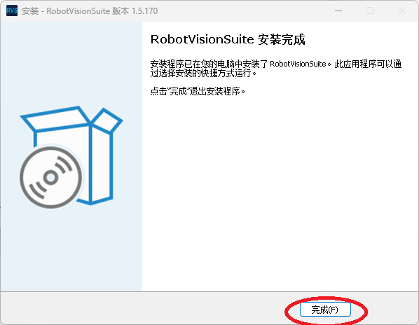
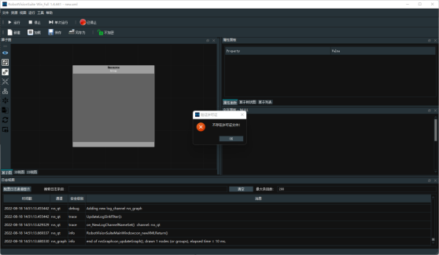
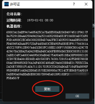

# 1 软件环境搭建

## 计算机配置

|要求|配置|
|----|----|
|CPU|12th Gen Intel(R) Core(TM) i7-12700H 2.30 GHz|
|GPU|NVIDIA GeForce RTX 3050及以上|
|内存|16.0 GB|
|硬盘|128G 可用空间|
|网口|千兆网口|
|系统|Windows10及以上|

## 1.1 python 安装
建议安装python3.8以上版本，Python官方下载地址: https://www.python.org/downloads/






## 1.2 依赖库安装
打开一个控制台终端(快捷键Win+R,输入cmd进入终端)，输入以下命令后按下键盘回车键
```bash
pip install pymycobot==4.0.6
```

##  1.3 软件包获取
下载地址：https://github.com/elephantrobotics/Pro450_3D_Kit

在浏览器输入下载地址，软件包下载完成后，解压即可


<br/>


##  1.4 RVS安装
<!-- RVS官方下载地址:http://res1.percipio.xyz/rvs/V1.8/RobotVisionSuite.zip -->


在软件包中，找到RVS安装程序，双击程序进行安装


<br/>



<br/>



路径不要有中文，建议安装C盘以外的其他盘



<br/>



<br/>


**运行并激活（申请版许可证）**

双击快捷方式，首次启动RVS。在启动动画结束后，会出现以下提示。



点击 “OK”，在许可证对话框点击 “Copy”，复制机器码，将机器码发给我们售后同事



我们收到机器码后的，会提供一个激活文件，激活文件是一个license.txt，或者是一段字符串，自行保存为 license.txt，请将这个 txt 文件拷贝到 RVS 安装目录下的 license 目录下。


## 1.5 相机调参软件

<!-- 相机调参软件下载地址：https://en.percipio.xyz/downloadcenter/
 -->
在软件包中，找到percipio应用程序，双击即可运行程序，无需安装


## 1.6 工程文件配置

<!-- 工程文件下载地址：https://github.com/elephantrobotics/Pro3D_Kit/tree/main

 -->


在软件包中，把location_demo整个文件夹拷贝到RobotVisionSuite的runtime目录下


---

[← 上一章](./1.1-introduction.md) | [下一章 →](./book2.md)