# 2 硬件安装

<!-- 可参考视频教程中的硬件安装章节：https://www.bilibili.com/video/BV1xxTNzxEL2/?spm_id_from=333.337.search-card.all.click&vd_source=672e3f7240eaaca210b45e7c033dc45f -->

根据下面的效果预览图，将各个物品摆放到对应的位置

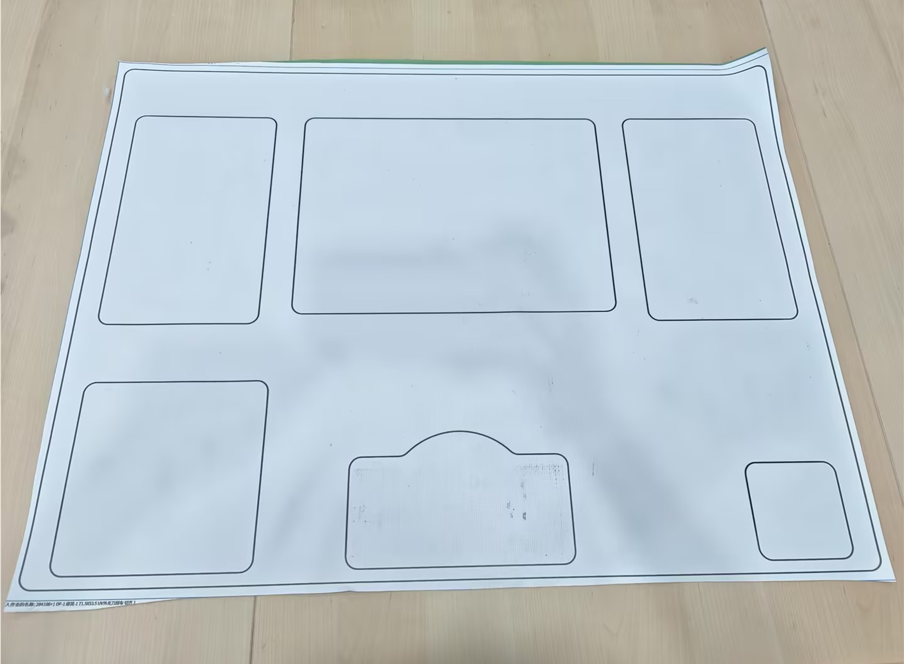

## 2.1 机械臂安装

参考pro450开箱视频的0-30秒片段完成机械臂的安装，以及对USB转网口转接器的IP地址分配

<video width="800" controls>
  <source src="https://download.elephantrobotics.com/software/MyCobot%20Pro%20450/myCobot%20Pro%20450%20%E5%BC%80%E7%AE%B1%E8%A7%86%E9%A2%91%200720%2001.mp4">
</video>

## 2.2 相机安装

将相机摆放到桌面，注意摆放时，务必要注意相机的接线口要按照下图的位置摆放，若是摆放错误，会导致后续出现抓取异常的情况

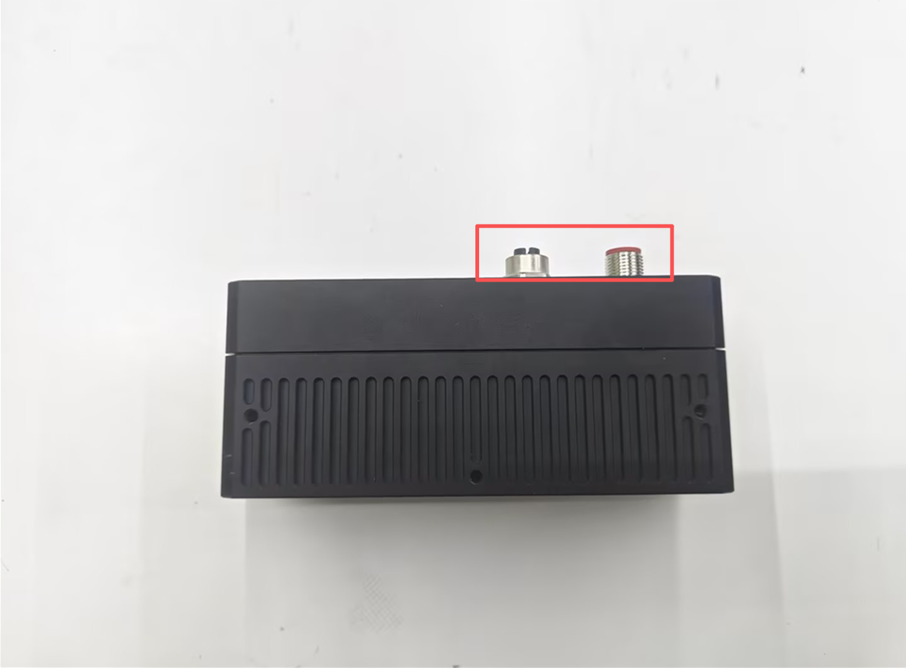

参考下面步骤将相机法兰安装在相机上

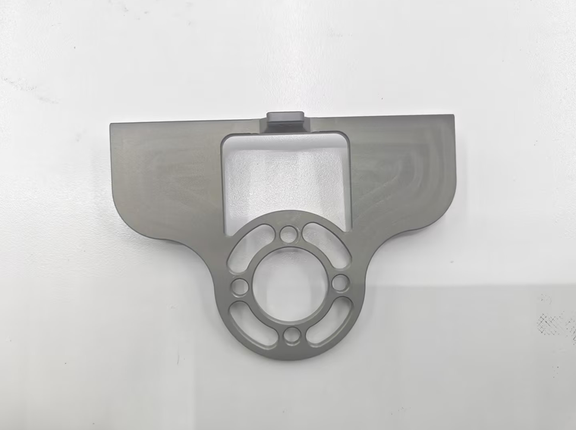

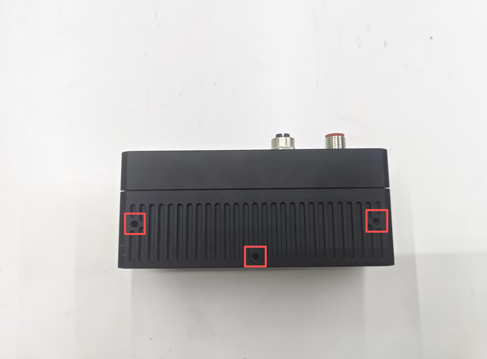

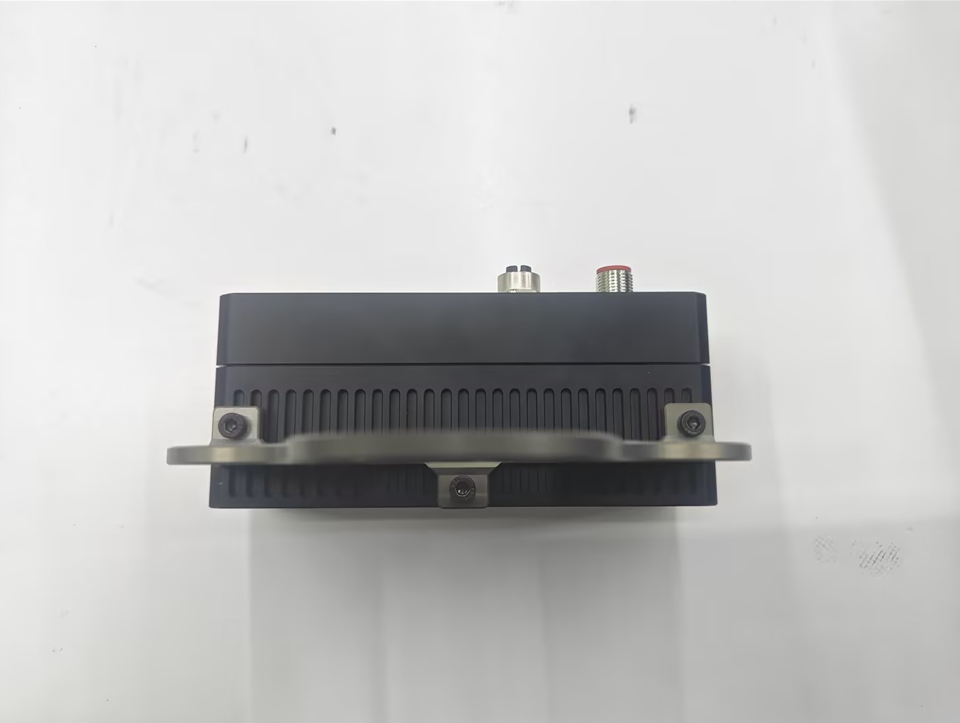

给相机接上通信线，通信线一端是航空插，一端是网线头，航空插上有缺口，按照缺口插入后拧紧，带网线头的一端接到电脑上

给相机接上电源线，电源线一端是航空插，一端是8根散线，航空城上有缺口，按照缺口插入后拧紧

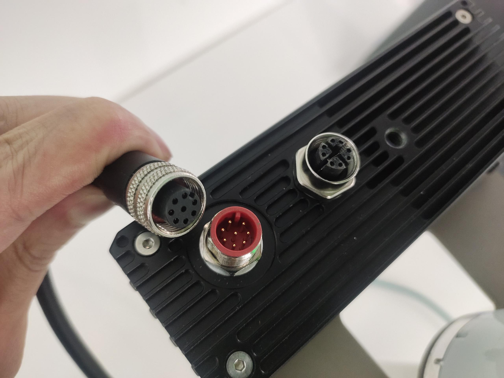

然后将电源线散线的一端，找出棕色和绿色两根线，之后再将两根线接到端子上，其余线可剪断，将端子插到机械臂的输入端，注意插入前要观察，棕色对应24V，绿色对应GND，不能接反，否则会造成相机损坏

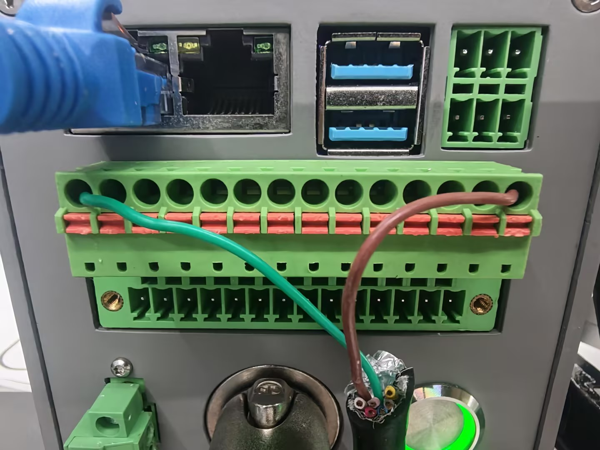

务必按照下图将相机法兰连同吸盘安装在机械臂末端法兰上，若是安装的位置与图片不符，会导致后续出现抓取异常的情况

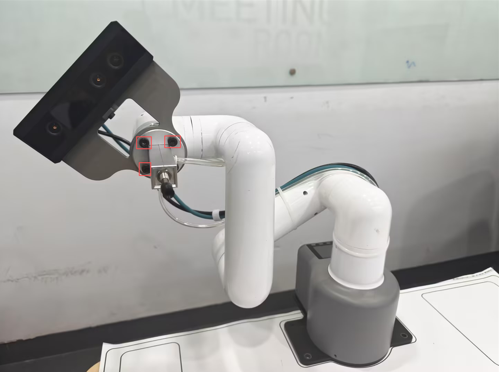

最后再将吸泵控制器的线按照下图，插到机械臂输出端上

按下机械臂电源按钮，观察相机的灯有无亮起

安装完的效果图

<!-- 先将相机法兰古固定到相机上

用roboflow将J3关节调到90度

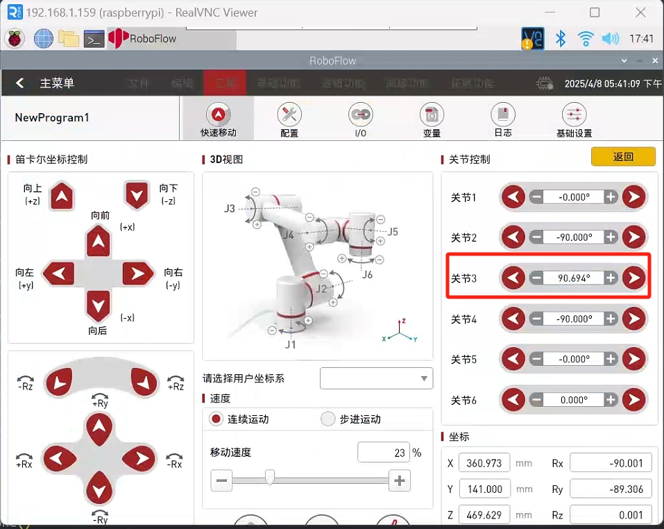

然后参考图片的方式，将相机和吸泵安装到机械臂末端法兰，相机的安装姿态务必要和图片中保持一致

给相机接上通信线，通信线一端是航空插，一端是网线头，航空插上有缺口，按照缺口插入后拧紧，带网线头的一端接到电脑上

给相机接上电源线，电源线一端是航空插，一端是8根散线，航空城上有缺口，按照缺口插入后拧紧

 

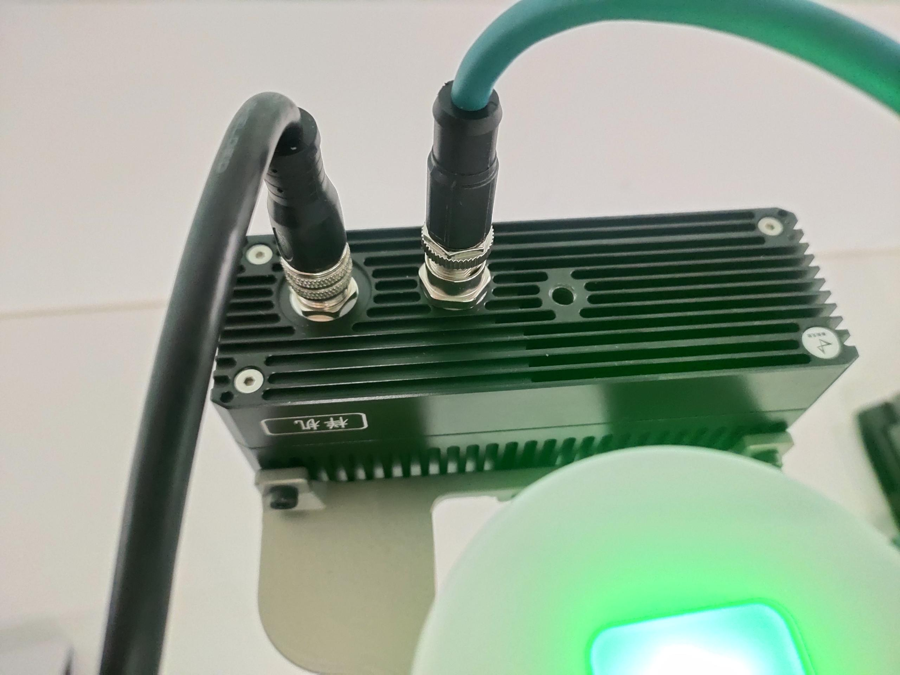

然后将电源线散线的一端，找出棕色和绿色两根线，之后再将两根线接到端子上

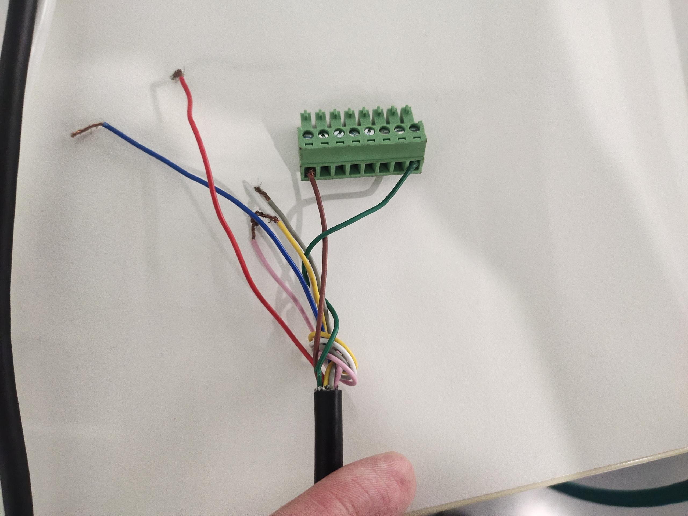

然后将端子插到机械臂的输入端，注意插入前要观察，棕色对应24V，绿色对应GND，不能接反，否则会造成相机损坏

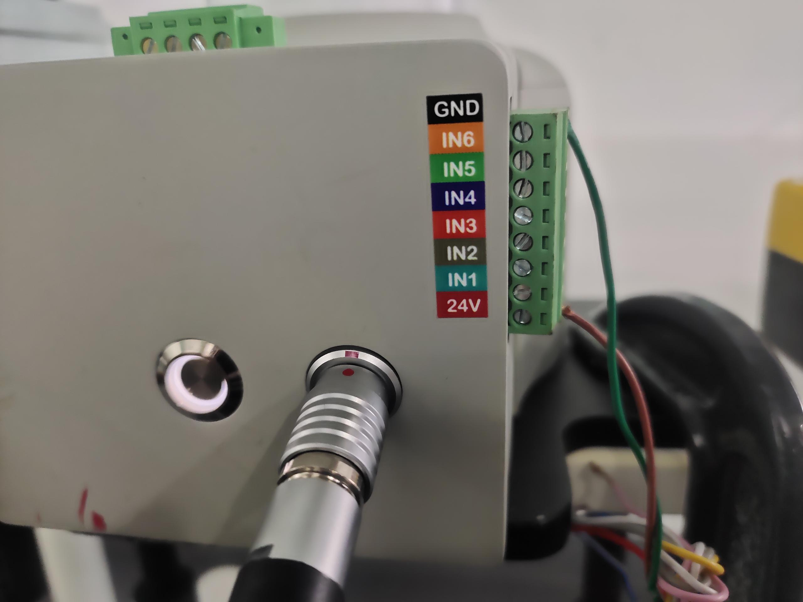

观察相机的灯有无亮起

最后将吸泵盒的控制线接到机械臂的输出端，即整体安装流程结束，相机线和气管可用魔术贴固定在机械臂上

安装完的效果图

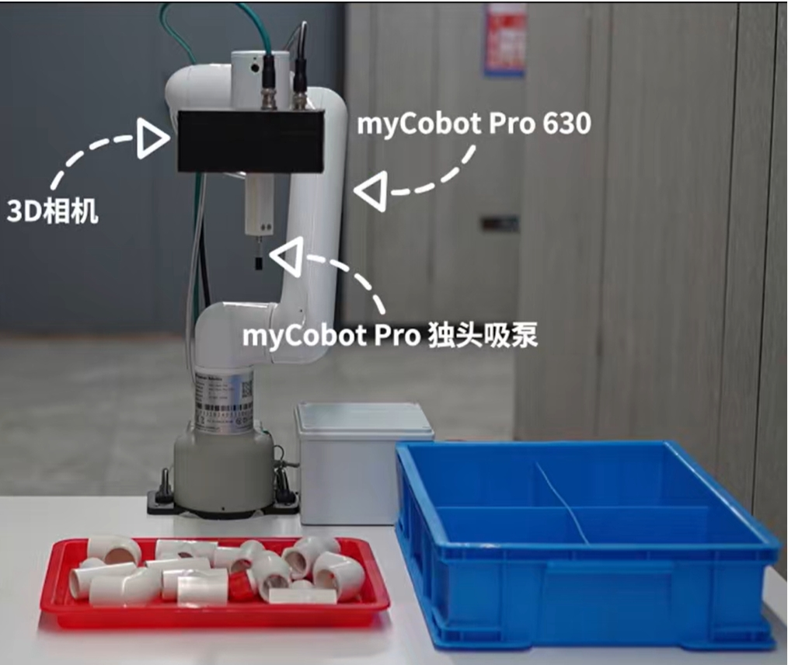 -->
