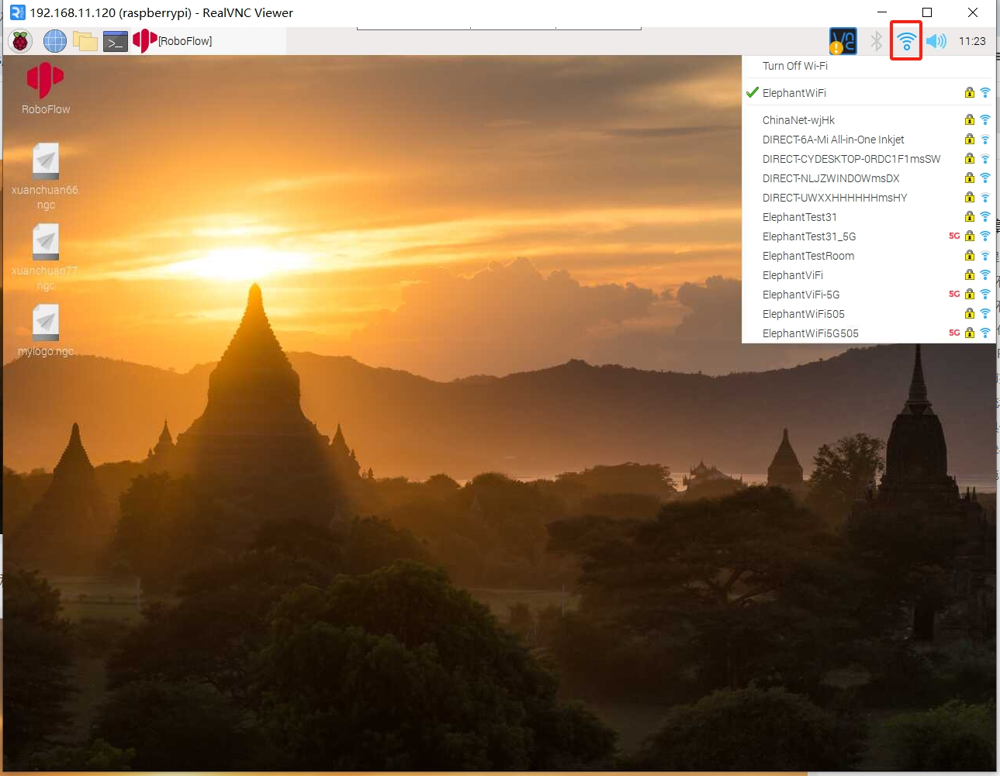
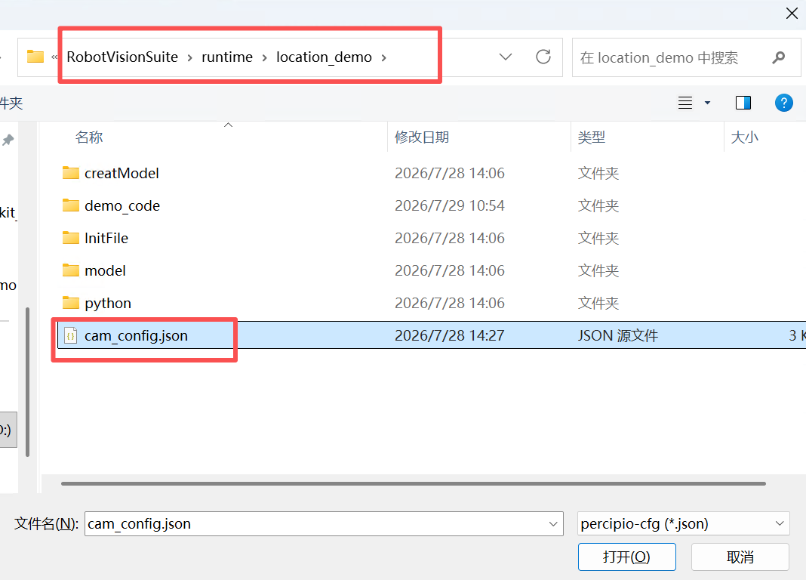
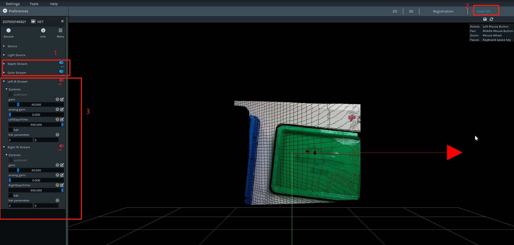
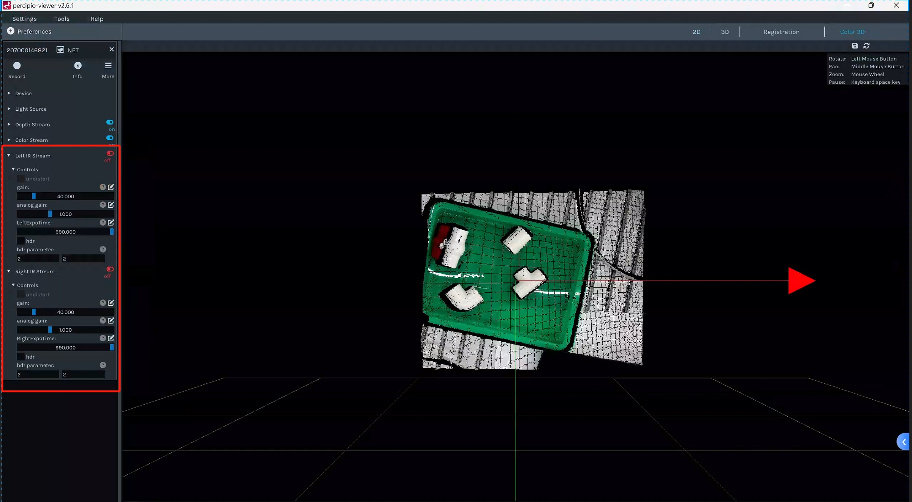
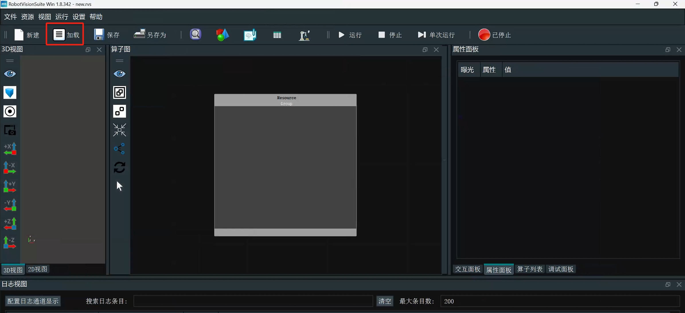
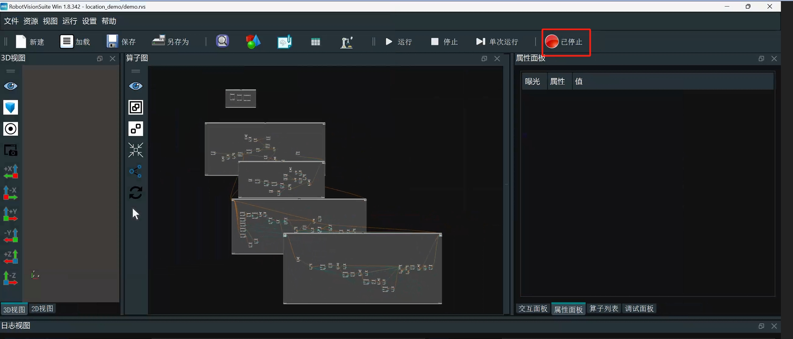
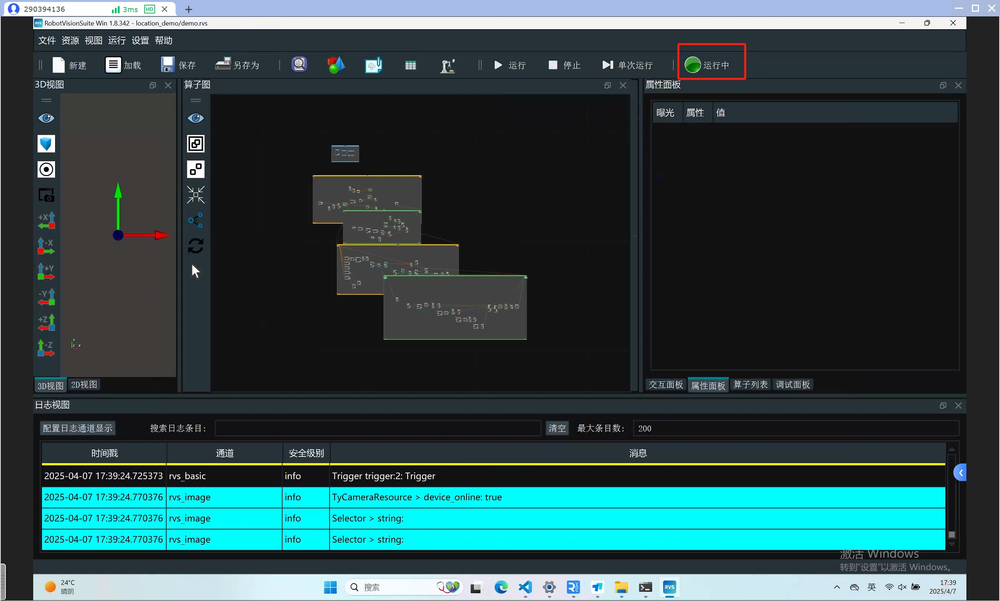
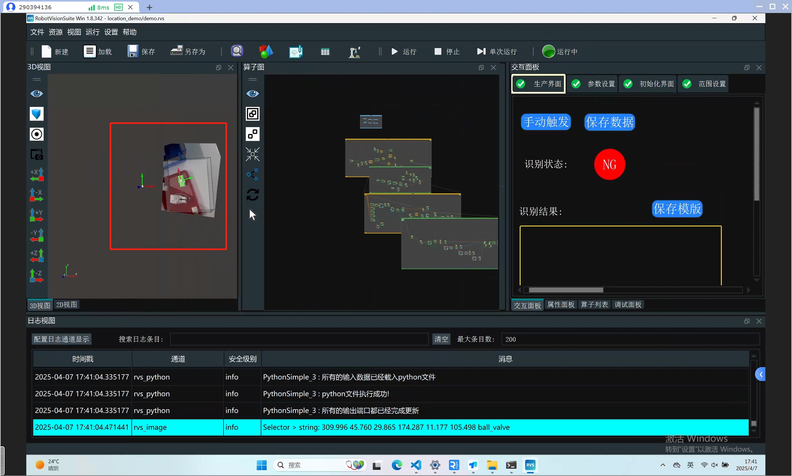

# 3 单元测试

## 3.1 机械臂&吸泵测试

运行location_demo文件夹中的demo_code文件夹中的test.py文件,机械臂会回到关节零位后，再运动到拍照位，打开吸泵2秒后关闭

<!-- 选择你要连接的wifi热点，输入密码连接后，查看机器人的无线IP，客户使用的电脑必须连接和机器人同一个wifi热点，打开vnc，输入机械臂的无线IP及用户名和密码

鼠标只需移动到WiFi图标，即可显示无线IP

运行location_demo文件夹中的demo_code文件夹中的test.py文件,机械臂会回到关节零位后，打开吸泵2秒后关闭

**注意**：
robot_ip要改成机械臂的实际的无线IP -->

## 3.2 相机测试

<!-- 可参考视频教程中的相机调试章节：https://www.bilibili.com/video/BV1xxTNzxEL2/?spm_id_from=333.337.search-card.all.click&vd_source=672e3f7240eaaca210b45e7c033dc45f
**视频章节时间节点**：1分44秒至2分46秒 -->

将与相机连接的有线网卡IP改成自动分配，相机与电脑的连接必须是直连，不能通过USB转网口转接器连接

相机参数文件在RobotVisionSuite的安装位置的runtime\location_demo目录下

参考下面动态图，打开相机调参软件，连接相机,对相机参数进行加载,当相机参数加载完成后，一定要关闭相机调参软件，否则会导致后面出现相机资源占用的问题

**注意事项**：机械臂每次重新开关机后，都需要对相机的参数进行重新调整，确保点云的成像质量，否则会出现点云匹配失败的情况

<!-- 打开相机调参软件，连接相机

先点击相机的彩色图和深度图获取按钮，然后点击彩色点云模式，调整相机的增益参数，可根据实际情况调节，Left lR Stream和Right IR Stream里面的参数调整要保持一致。点云调整的和图片中的效果即可。调整完后务必要关掉相机参数调整软件

 -->

<!-- <video width="800" controls>
  <source src="../img/Operating_steps.mp4" type="video/mp4">
</video> -->

<!-- 具体操作请参考视频，可下载到本地电脑观看，视频地址：https://github.com/elephantrobotics/Pro3D_Kit/blob/mv/rvs_cam.mp4

参数调整后点云

 -->

<!-- 双击桌面RVS图标后，待RVS打开后，点击加载

然后选择location_demo文件夹下的demo.rvs文件

然后点击运行

等待相机初始化

 

相机初始化成功后，点击交互面板，再点击手动触发

有画面输出即可

 -->

---

[← 上一章](./book2.md) | [下一章 →](./hand_eye.md)