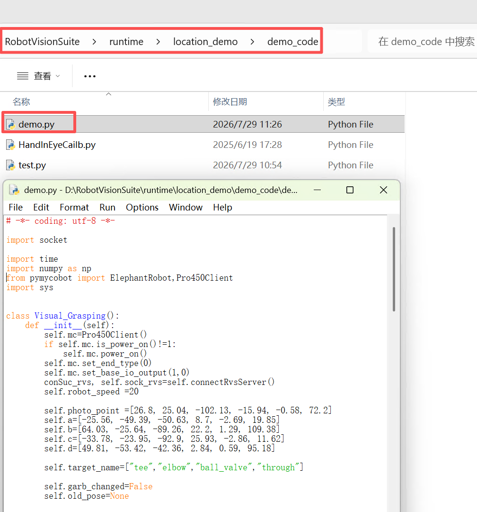
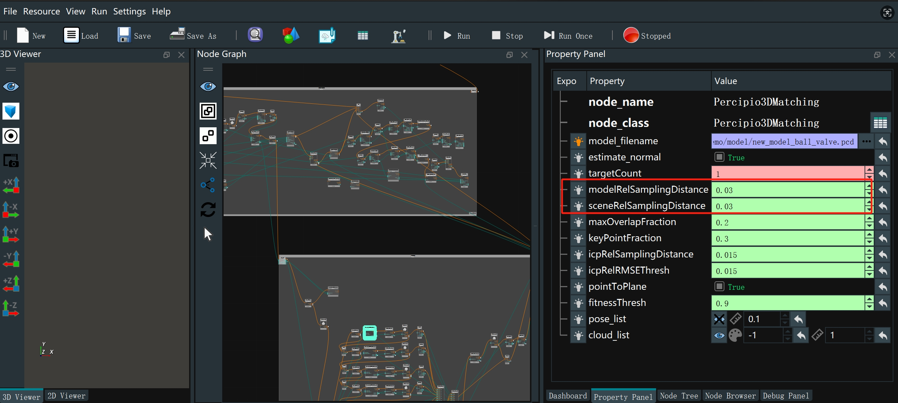

## 5 案例复现

<!-- 可参考视频教程中的抓取演示章节：https://www.bilibili.com/video/BV1xxTNzxEL2/?spm_id_from=333.337.search-card.all.click&vd_source=672e3f7240eaaca210b45e7c033dc45f
**视频章节时间节点**：6分27秒至6分55秒 -->

<!-- **注意事项**：4种PVC工件已创建好点云模板，用户无需再创建，直接使用即可 -->

##  5.1 工件摆放
将PVC工件摆放到托盘内,工件之间不能堆叠,必须是平整摆放

## 5.2 复现步骤

双击桌面RVS图标后,待RVS打开后,点击加载

然后选择location_demo文件夹下的demo.rvs文件

然后点击运行

等待相机初始化

 

运行location_demo文件夹中的demo_code文件夹中的demo.py文件

**注意事项**

程序运行后，相机回到拍照位置后，不能中途往托盘里面放入工件，避免相机误识别，导致机械臂发生碰撞等风险

<!-- ## 5.4 注意事项

程序运行后，相机回到拍照位置后，不能中途往托盘里面放入工件，避免相机误识别，导致机械臂发生碰撞等风险 -->

<!-- # 5.3 点云采样间隔与抓取耗时说明

在RVS的Percipio3DMatching算子中，modelRelSamplingDistance和sceneRelSamplingDistance用于调整模板匹配过程中的点云采样间隔，采样间隔越小，匹配耗时就会增加，单个工件完整的识别抓取耗时就会变长，但是可以提高工件的识别正确率。正常情况下无需调整，直接使用即可，若要调整，两个参数的调整数值要一样

 -->

---

[← 上一章](./hand_eye.md) | [下一章 →](./readme.md)