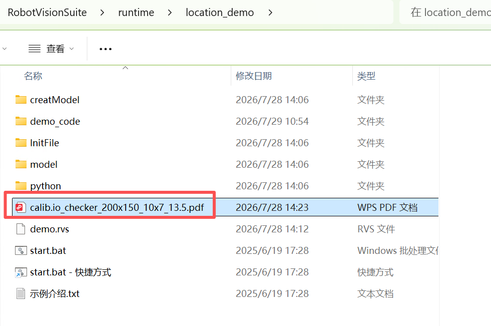
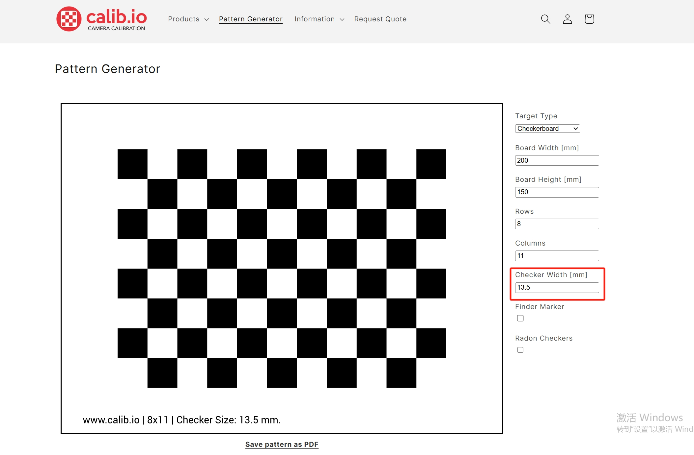
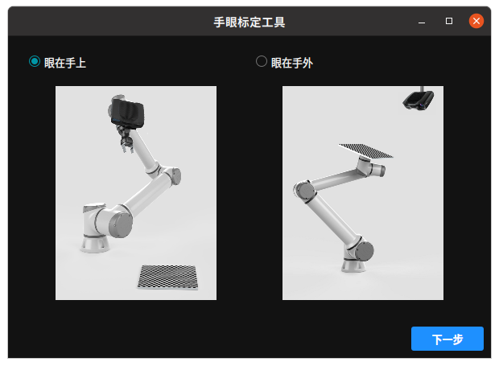
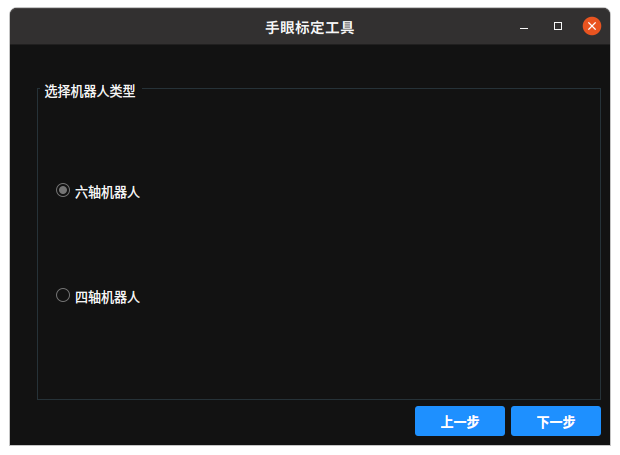
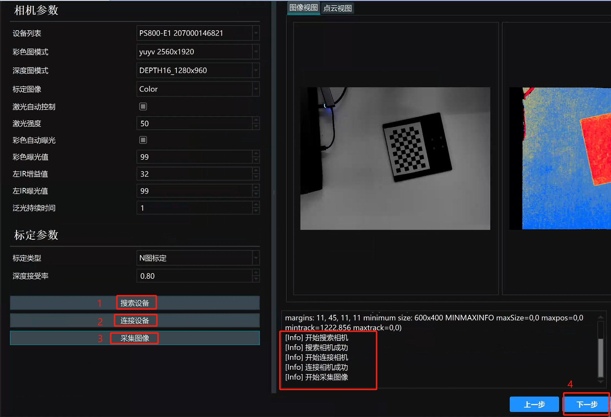
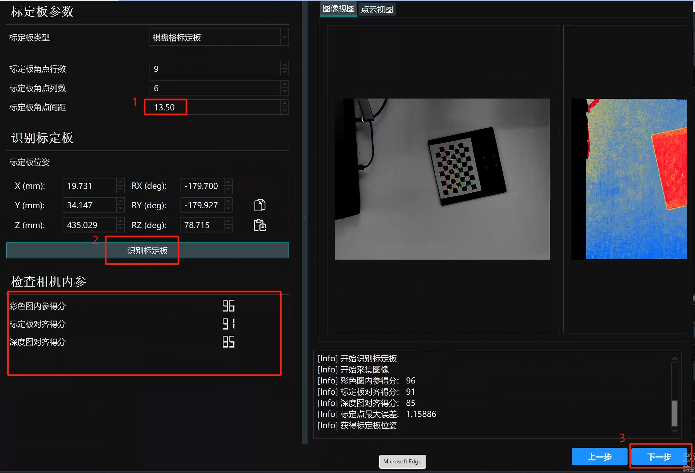
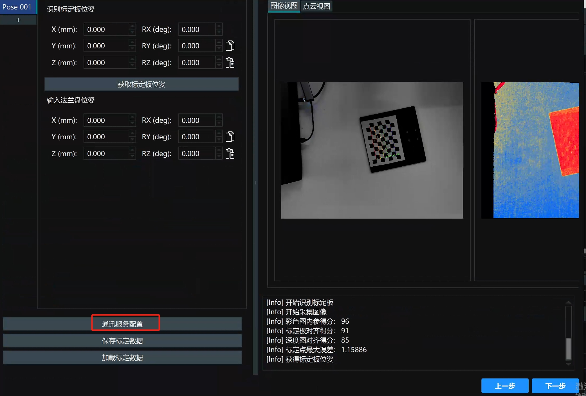
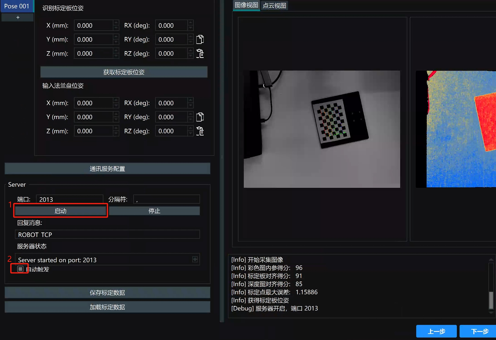
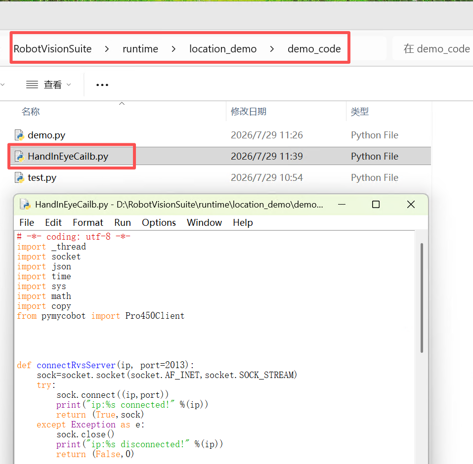
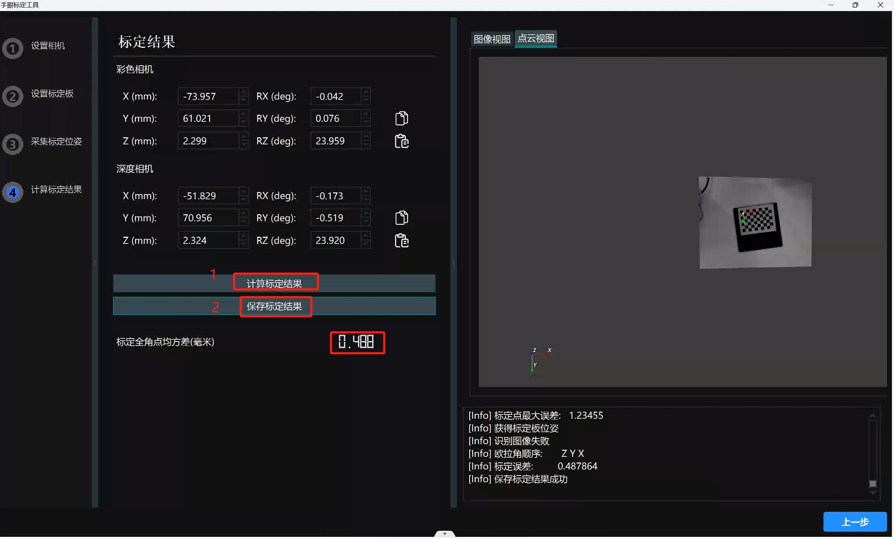

# 4 手眼标定

<!-- 可参考视频教程中的手眼标定章节：https://www.bilibili.com/video/BV1xxTNzxEL2/?spm_id_from=333.337.search-card.all.click&vd_source=672e3f7240eaaca210b45e7c033dc45f
**视频章节时间节点**：2分47秒至4分10秒 -->

<!-- 标定板生成网站：https://calib.io/pages/camera-calibration-pattern-generator
可按照图片参数进行设置，用打印机打印出来 -->

在相机工程中，找到标定板文件，用打印机打印出来即可

<!--  -->

点击菜单栏中手眼标定工具即可打开手眼标定工具窗口

选择眼在手上,点击下一步

选择多位姿标定,点击下一步

选择六轴机器人,点击下一步

安装图片的引导，按顺序点击按钮，待点击按钮后，日志输出后，再进行下一步操作，标定盘尽量放在视野中央，确保机械臂每次移动后都能完整拍到标定板

标定板间距按照标定板的一个格子的边长填写，点击识别标定板，待输出得分后，再点击下一步

点击通讯服务配置

按照图片标注，依次点击按钮

运行location_demo文件夹中的demo_code文件夹中的HandInEyeCailb.py文件，运行程序后，不得移动标定板

待程序结束后，点击下一步，点击计算标定结果，待输出结果后，再点击保存标定结果，保存到location_demo文件中的InitFile文件夹

 

 

