# 1 Software environment setup

## Computer configuration

|Requirements|Configuration|
|----|----|
|CPU|12th Gen Intel(R) Core(TM) i7-12700H 2.30 GHz|
|GPU|NVIDIA GeForce RTX 3050 and above|
|Memory|16.0 GB|
|Hard disk|128G available space|
|Network port|Gigabit network port|
|System|Windows 10 and above|

## 1.1 Python installation
It is recommended to install Python 3.8 or above. Official Python download address: https://www.python.org/downloads/

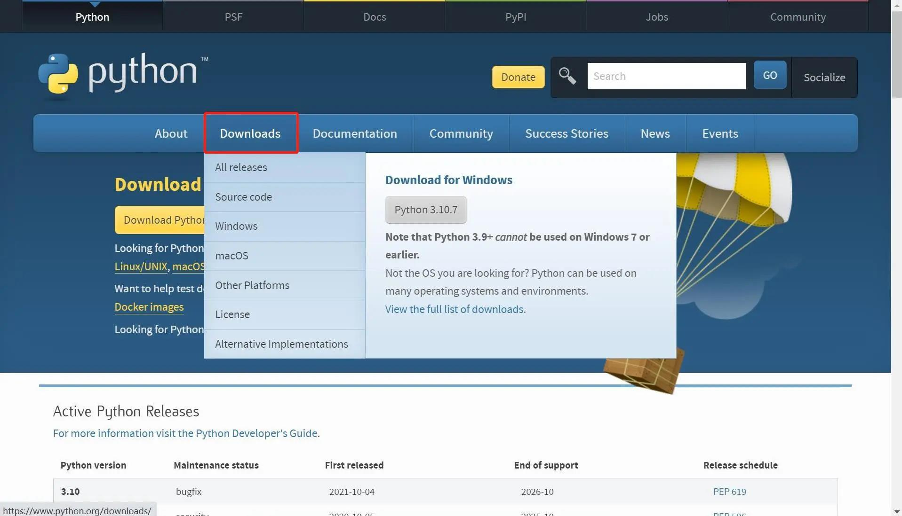

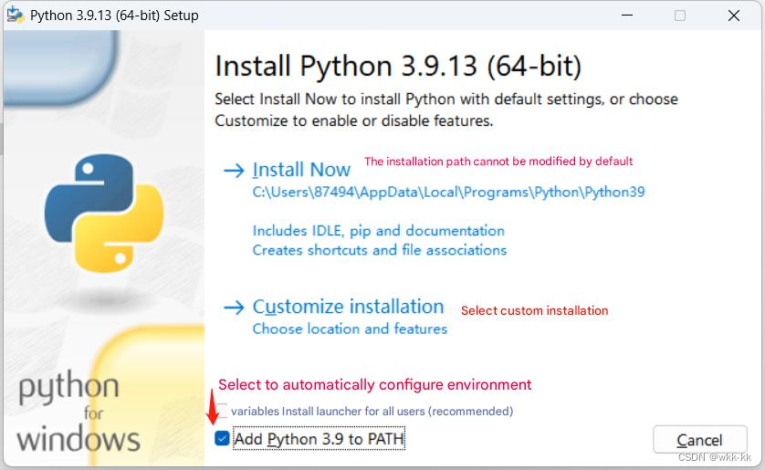

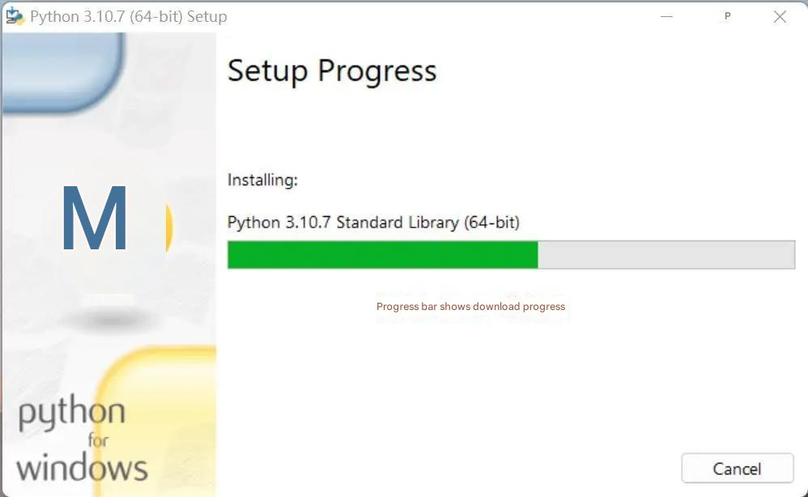

## 1.2 Dependent library installation
Open a console terminal (shortcut Win+R, enter cmd to enter the terminal), enter the following command and press the Enter key on the keyboard
```bash
pip install pymycobot==4.0.6
```

## 1.3 Software package acquisition
Download address: https://github.com/elephantrobotics/Pro450_3D_Kit

Enter the download address in the browser, and after the software package is downloaded, unzip it.

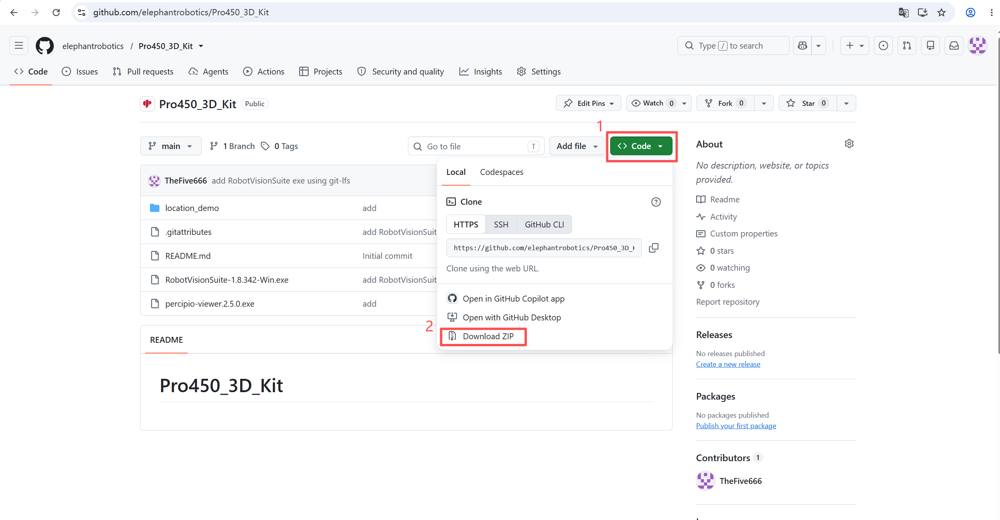

<br/>

## 1.4 RVS installation
<!-- RVS official download address: http://res1.percipio.xyz/rvs/V1.8/RobotVisionSuite.zip -->

In the software package, find the RVS installer and double-click the program to install it.

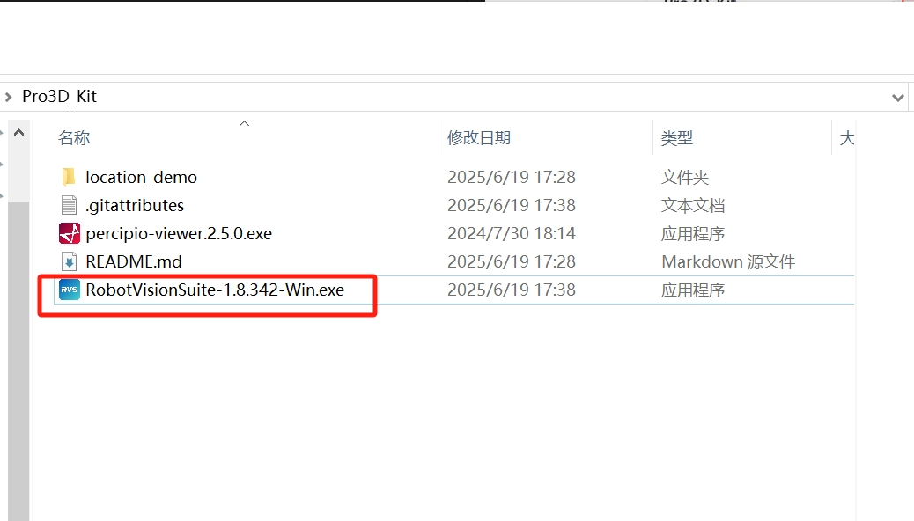

<br/>

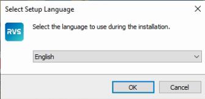

<br/>

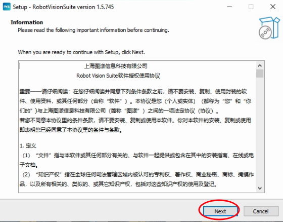

The path should not contain Chinese characters. It is recommended to install other disks other than C drive

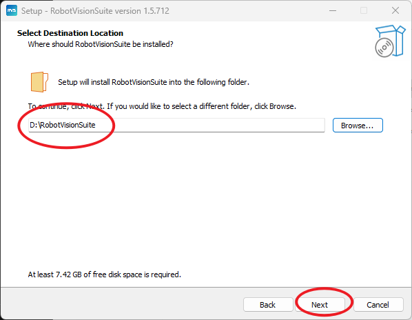

<br/>

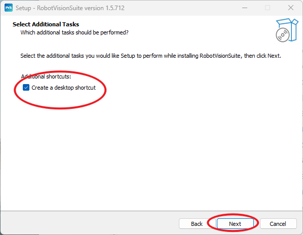

<br/>
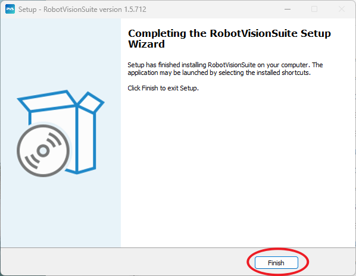

**Run and activate (application version license)**

Double-click the shortcut to start RVS for the first time. After the startup animation, the following prompt will appear.

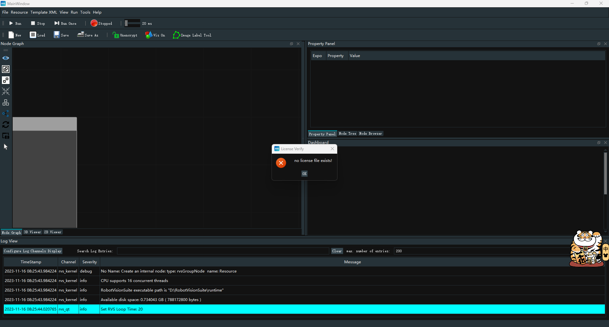

Click "OK", click "Copy" in the license dialog box, copy the machine code, and send the machine code to our after-sales colleagues

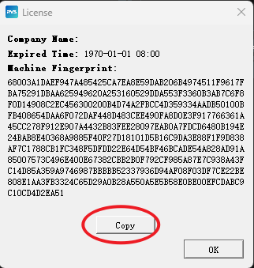

After we receive the machine code, we will provide an activation file. The activation file is a license.txt, or a string, which is saved as license.txt. Please copy this txt file to the license directory under the RVS installation directory.

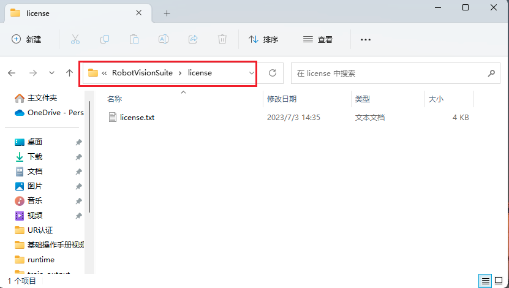

## 1.5 Camera parameter adjustment software

<!-- Camera parameter adjustment software download address: https://en.percipio.xyz/downloadcenter/
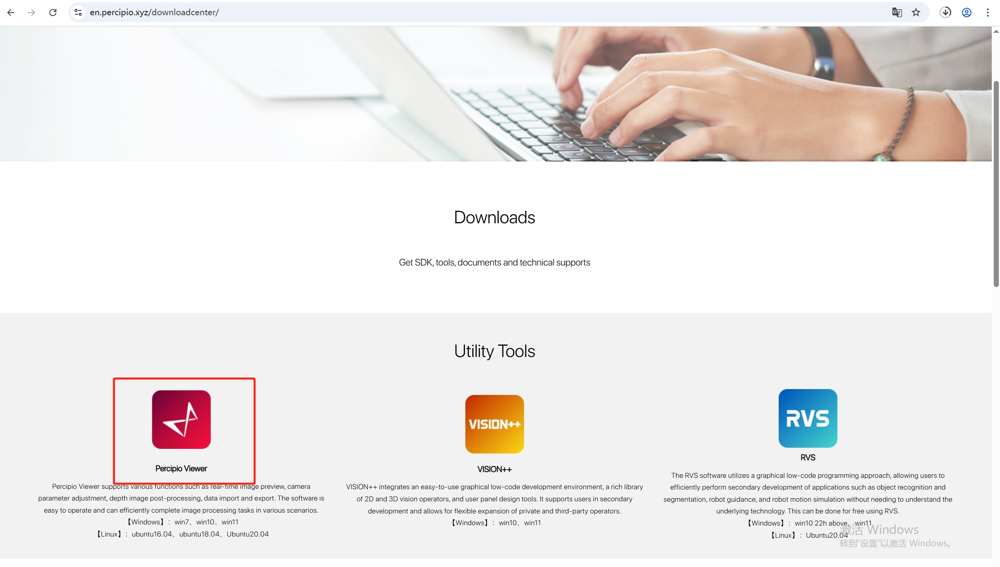 -->
In the software package, find the percipio application and double-click to run the program without installation

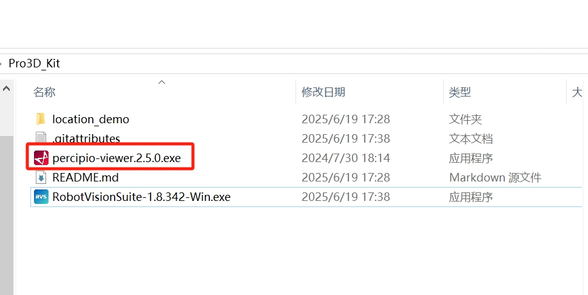

## 1.6 Project file configuration

<!-- Project file download address: https://github.com/elephantrobotics/Pro3D_Kit/tree/main

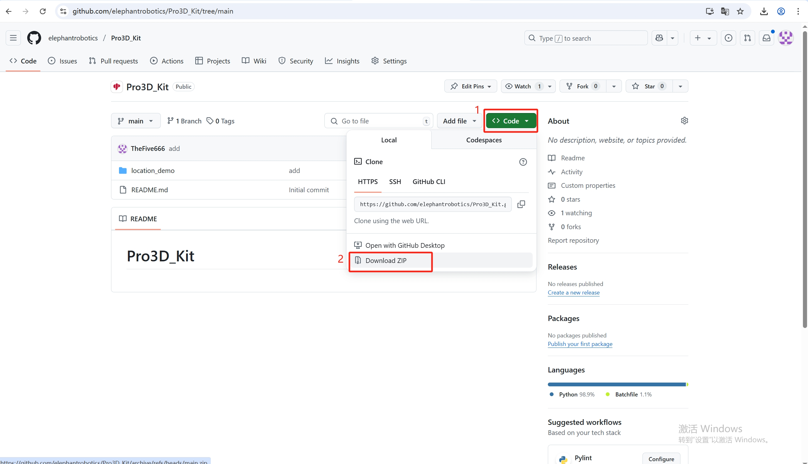 -->

In the software package, copy the entire location_demo folder to the RVS installation directory

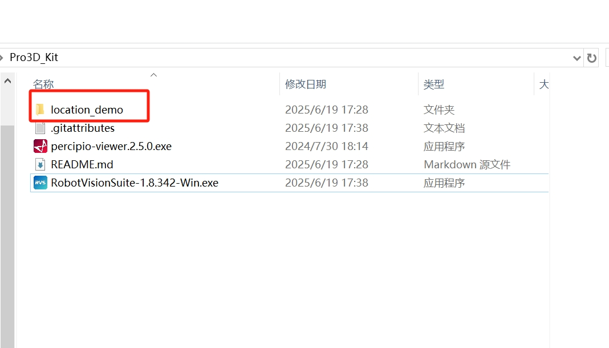

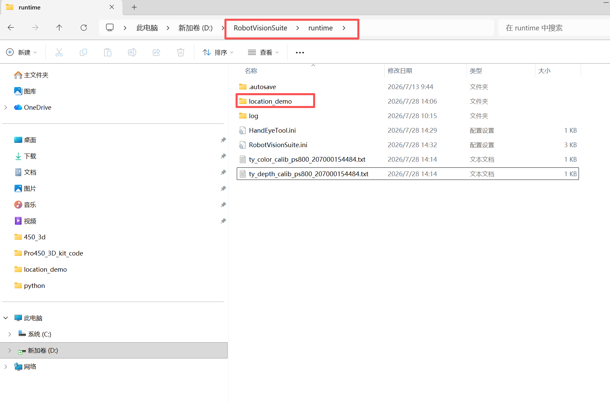

---

[← Previous Chapter](./readme.md) | [Next Chapter →](./book2.md)