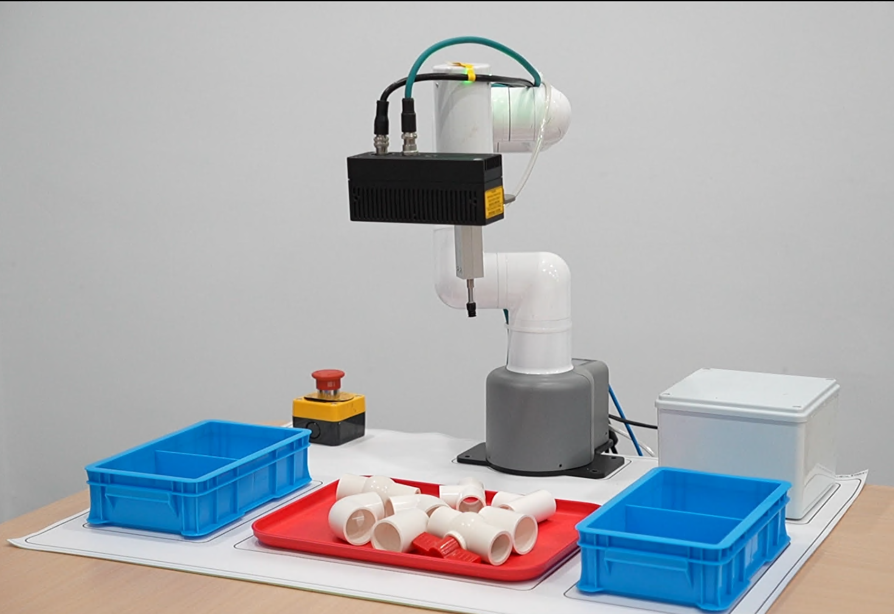
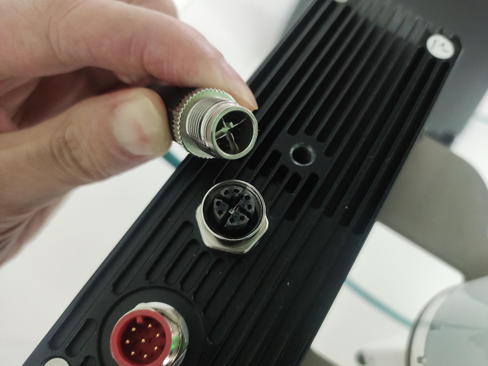
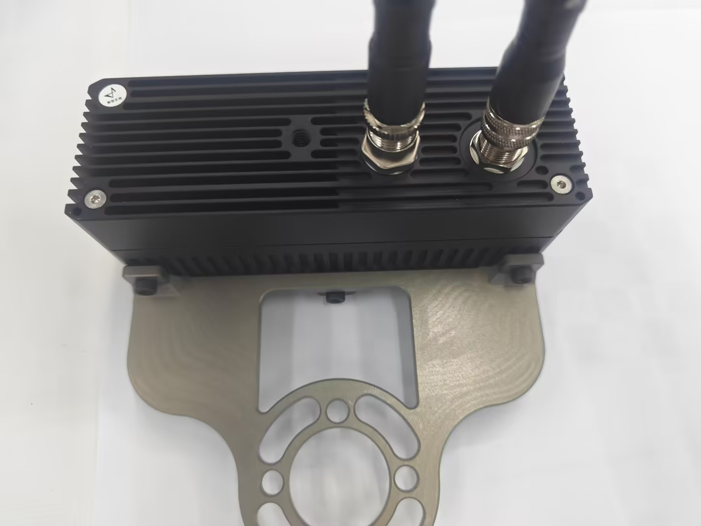
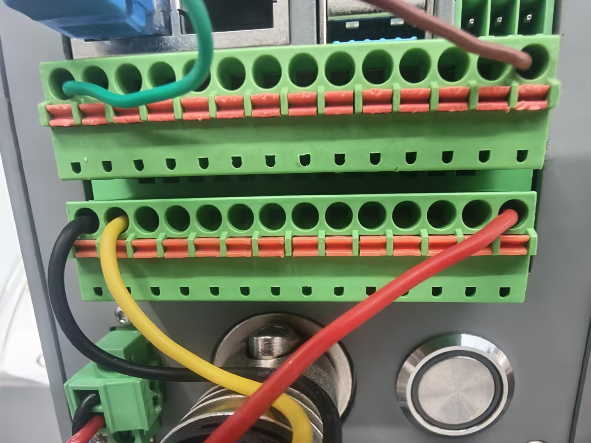
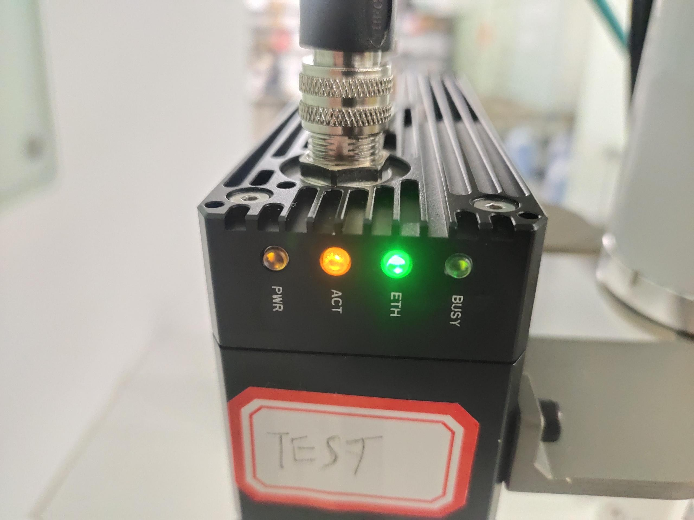
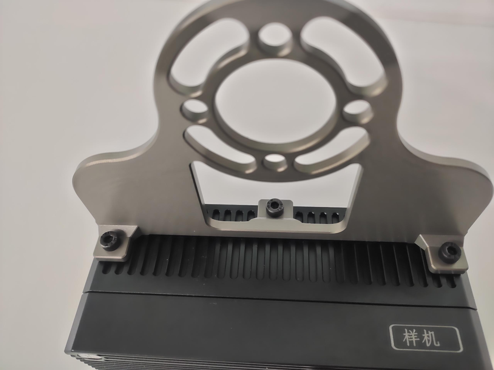
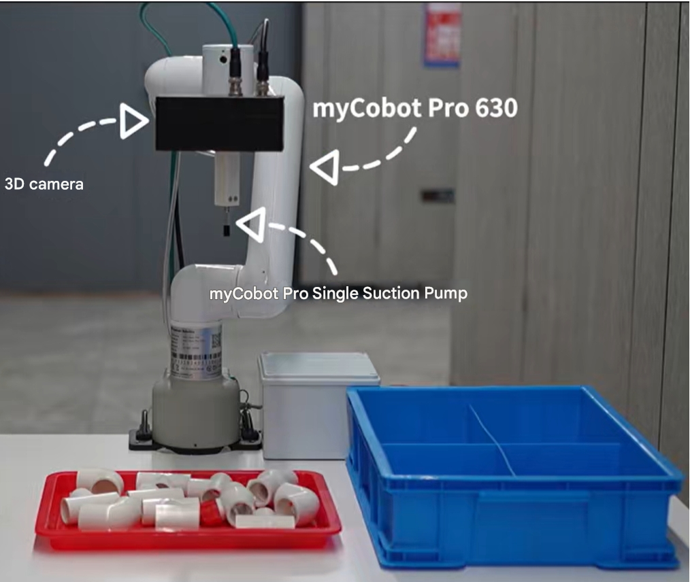

# 2 Hardware Installation

<!-- Refer to the hardware installation section of the video tutorial: https://www.bilibili.com/video/BV1xxTNzxEL2/?spm_id_from=333.337.search-card.all.click&vd_source=672e3f7240eaaca210b45e7c033dc45f -->

Place each item in its corresponding position according to the preview image below.

## 2.1 Robotic Arm Installation

Refer to the 0-30 second segment of the Pro450 unboxing video to complete the installation of the robotic arm and the IP address assignment for the USB-to-Ethernet adapter.

<video width="600" controls>

<source src="https://download.elephantrobotics.com/software/MyCobot%20Pro%20450/myCobot%20Pro%20450%20Base%20Plate%20Installation.mp4">

</video>

## 2.2 Camera Installation

Place the camera on the desktop. When placing it, make sure the camera's connectors are positioned as shown in the image below. Incorrect placement will cause capture errors later.

Refer to the steps below to install the camera flange onto the camera.

Connect the communication cable to the camera. One end of the communication cable is an aviation connector, and the other end is a network cable connector. The aviation connector has a notch; insert it according to the notch and tighten it. Connect the end with the network cable connector to the computer.

Connect the power cord to the camera. One end of the power cord is an aviation connector, and the other end has 8 loose wires. The aviation connector has a notch; insert it according to the notch and tighten it.

Then, find the brown and green wires at one end of the power cord's loose wires. Connect these two wires to the terminals. The remaining wires can be cut. Plug the terminals into the input end of the robotic arm. Before plugging, carefully observe that brown corresponds to 24V and green corresponds to GND. Do not reverse them, otherwise it will damage the camera.

Be sure to install the camera flange along with the suction cup onto the end flange of the robotic arm as shown in the picture below. If the installation position does not match the picture, it will cause subsequent grasping abnormalities.

Finally, plug the suction pump controller wires into the output end of the robotic arm as shown in the picture below.

 

Image showing the completed installation

<!-- First, fix the camera flange to the camera.

Use Roboflow to adjust the J3 joint to 90 degrees.

Then, referring to the image, install the camera and suction pump onto the end flange of the robotic arm. The camera's installation posture must be consistent with that in the image.

  

Connect the communication cable to the camera. One end of the communication cable is an aviation connector, and the other end is a network cable connector. The aviation connector has a notch; insert it according to the notch and tighten it. Connect the end with the network cable connector to the computer.

Connect the power cable to the camera. One end of the power cable is an aviation connector, and the other end has 8 loose wires. The aviation connector has a notch; insert it according to the notch and tighten it.

 

Then, find the brown and green wires on the loose wire end of the power cable, and connect these two wires to the terminals.

 Next, plug the terminals into the input end of the robotic arm. Before plugging, carefully observe that brown corresponds to 24V and green corresponds to GND. Do not reverse the connections, otherwise it will damage the camera.

Check if the camera lights are on.

Finally, connect the control wire from the suction pump box to the output end of the robotic arm. This completes the installation process. The camera cable and air hose can be secured to the robotic arm using Velcro.

Image showing the finished installation.

 -->

---

[← Previous Chapter](./book1.md) | [Next Chapter →](./book3.md)