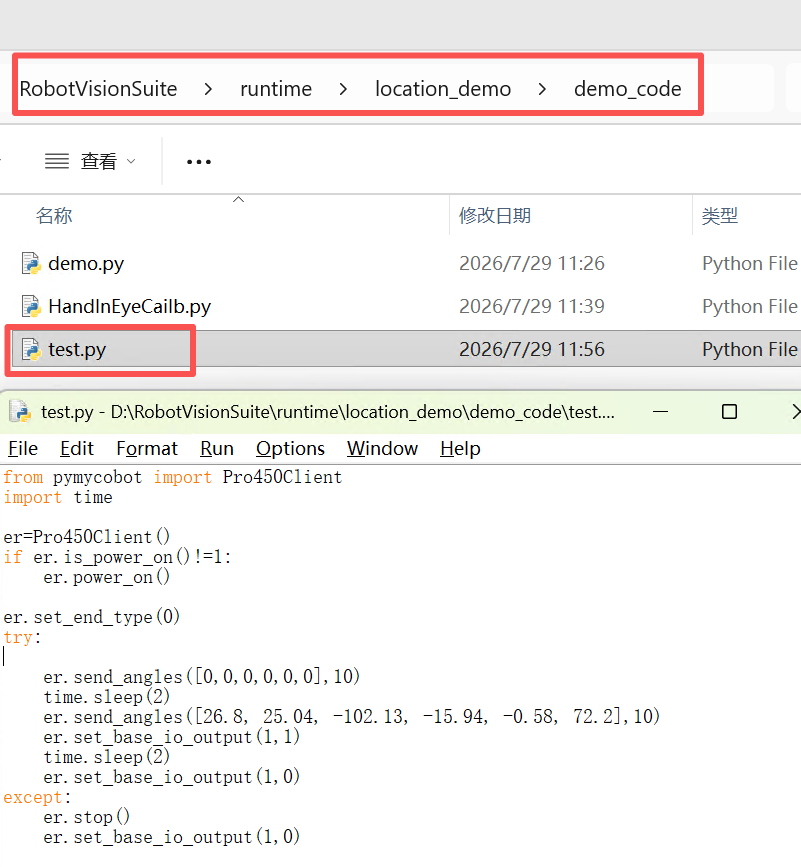
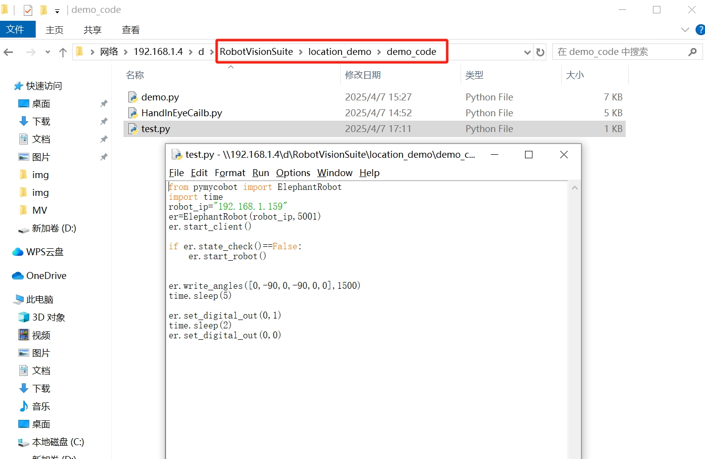
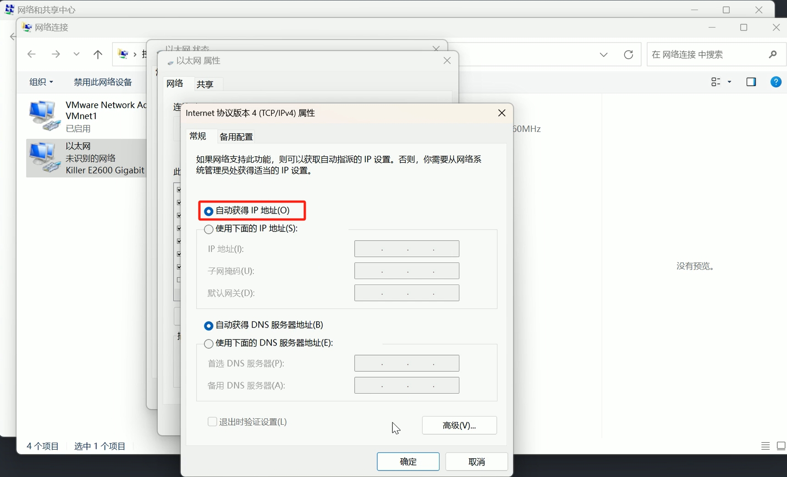
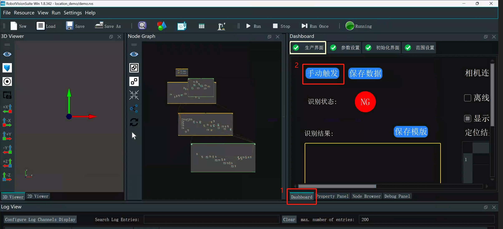

# 3 Unit Testing

## 3.1 Robotic Arm & Suction Pump Test

Run the `test.py` file in the `demo_code` folder within the `location_demo` folder. The robotic arm will return to its joint zero position, then move to the camera position, turn on the suction pump for 2 seconds, and then turn it off.

<!-- Select the Wi-Fi hotspot you want to connect to, enter the password, and then check the robot's wireless IP. The customer's computer must be connected to the same Wi-Fi hotspot as the robot. Open VNC, and enter the robotic arm's wireless IP, username, and password.

Simply move the mouse over the Wi-Fi icon to display the wireless IP.

 

**Note:** Replace `robot_ip` with the robot's actual wireless IP address.

## 3.2 Camera Testing

<!-- Refer to the camera debugging section in the video tutorial: https://www.bilibili.com/video/BV1xxTNzxEL2/?spm_id_from=333.337.search-card.all.click&vd_source=672e3f7240eaaca210b45e7c033dc45f>
**Video section time points: 1 minute 44 seconds to 2 minutes 46 seconds> -->

Change the IP address of the wired network adapter connected to the camera to automatic assignment. The connection between the camera and the computer must be direct; it cannot be connected via a USB-to-Ethernet adapter.

The camera parameter file is located in the runtime\location_demo directory of the RobotVisionSuite installation directory.

Refer to the animated image below. Open the camera parameter adjustment software, connect the camera, and load the camera parameters. After the camera parameters are loaded, be sure to close the camera parameter adjustment software; otherwise, it will cause camera resource usage issues later.

**Important Notes:** The camera parameters need to be readjusted after each power cycle to ensure point cloud imaging quality; otherwise, point cloud matching may fail.

<!-- Open the camera parameter adjustment software and connect the camera.

First, click the camera's color image and depth image acquisition buttons. Then, click the color point cloud mode and adjust the camera's gain parameters. Adjust as needed, ensuring consistency in the parameters for Left IR Stream and Right IR Stream. The point cloud adjustment should match the effect shown in the image. After adjusting, be sure to close the camera parameter adjustment software.

 -->

<!-- <video width="800" controls>

<source src="../img/Operating_steps.mp4" type="video/mp4">

</video> -->

<!-- Please refer to the video for detailed instructions. You can download it to your local computer to watch. Video address: https://github.com/elephantrobotics/Pro3D_Kit/blob/mv/rvs_cam.mp4

Point cloud after parameter adjustment

 -->

<!-- Double-click the RVS icon on your desktop. After RVS opens, click Load.

Then select the demo.rvs file in the location_demo folder.

Then click Run.

Wait for the camera to initialize.

 

After the camera initializes successfully, click the interaction panel, then click Manual Trigger.

Once there is video output, that's it.

 -->

---

[← Previous Chapter](./book2.md) | [Next Chapter →](./hand_eye.md)