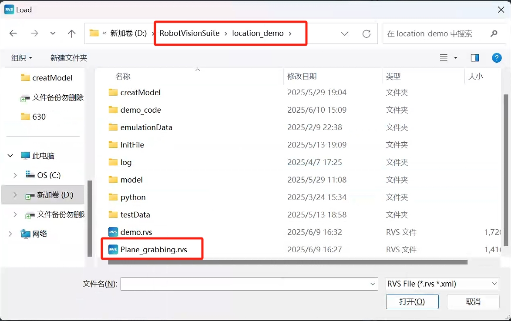
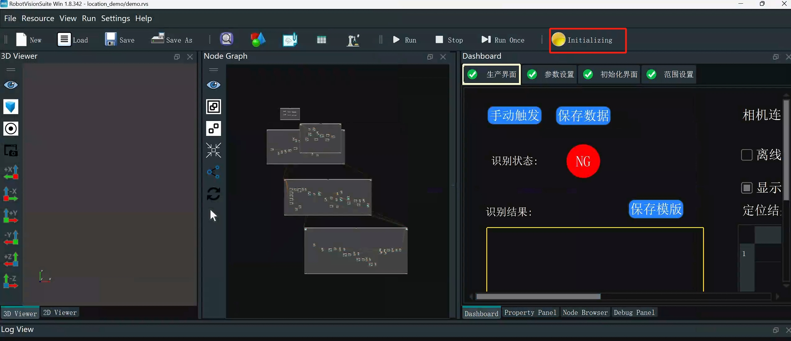
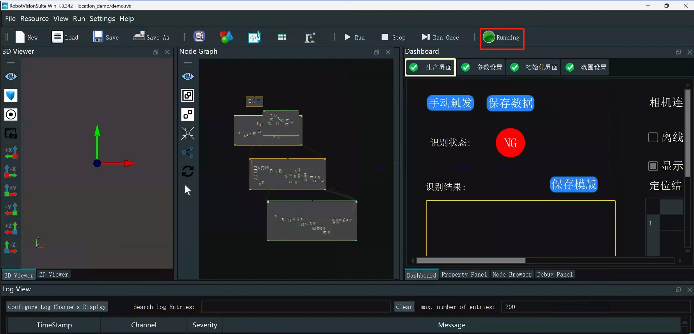
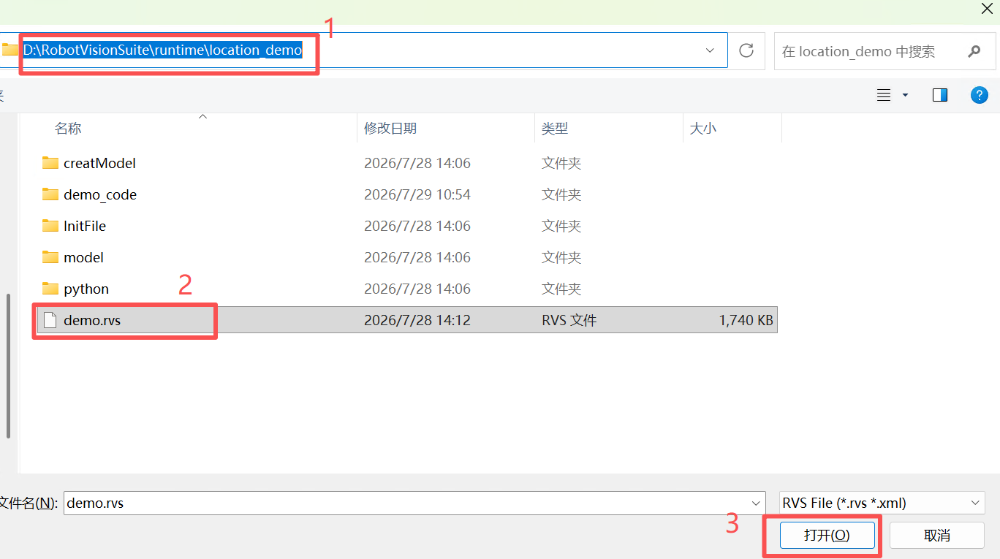

## 5 Case reproduction

<!-- Please refer to the crawling demonstration chapter in the video tutorial: https://www.bilibili.com/video/BV1xxTNzxEL2/?spm_id_from=333.337.search-card.all.click&vd_source=672e3f7240eaaca210b45e7c033dc45f
**Video chapter time node**: 6 minutes 27 seconds to 6 minutes 55 seconds -->

<!-- **Note**: Point cloud templates have been created for 4 types of PVC workpieces. Users do not need to create them again and can use them directly -->

## 5.1 Workpiece placement
Place the PVC workpieces in the tray. The workpieces cannot be stacked and must be placed flat

<!-- ## 5.2 Plane grabbing case
**Case effect description**: The plane grabbing case effect is without posture grabbing, that is, the posture of the end of the robot arm during grabbing will be exactly the same as the posture of the end of the robot arm at the photo position

Double-click the desktop RVS icon, wait for RVS to open, and click Load

Then select the Plane_grabbing.rvs file in the location_demo folder

Then click Run

Wait for the camera to initialize

 

Run the Plane_grabbing.py file in the demo_code folder in the location_demo folder

**Note**:
robot_ip should be changed to the actual wireless IP of the robot arm

**Note**

After the program runs, after the camera returns to the shooting position, the workpiece cannot be placed in the tray in the middle to avoid the risk of camera misidentification and robot arm collision -->

## 5.2 Reproduction Steps

<!-- **Case effect description**: The six-degree-of-freedom grabbing case effect is with posture grabbing, that is, the posture of the end of the robot arm during grabbing will not be completely consistent with the posture of the end of the robot arm at the shooting position -->

Double-click the desktop RVS icon, wait for RVS to open, and click Load

Then select the demo.rvs file in the location_demo folder

Then click Run

Wait for the camera to initialize

 

Run the demo.py file in the demo_code folder in the location_demo folder

<!-- **Note**:
robot_ip should be changed to the actual wireless IP of the robot -->

**Notes**

After the program is running, after the camera returns to the shooting position, the workpiece cannot be placed in the tray in the middle to avoid the risk of camera misidentification and robot arm collision

<!-- ## 5.4 Notes

After the program is running, after the camera returns to the shooting position, the workpiece cannot be placed in the tray in the middle to avoid camera misidentification and robot arm collision -->

<!-- # 5.4 Point cloud sampling interval and grabbing time description

In the Percipio3DMatching operator of RVS, modelRelSamplingDistance and sceneRelSamplingDistance are used to adjust the point cloud sampling interval in the template matching process. The smaller the sampling interval, the longer the matching time will be, and the time for complete recognition and grabbing of a single workpiece will be longer, but the recognition accuracy of the workpiece can be improved. Normally, no adjustment is required and it can be used directly. If adjustment is required, the adjustment values ​​of the two parameters must be the same

 -->