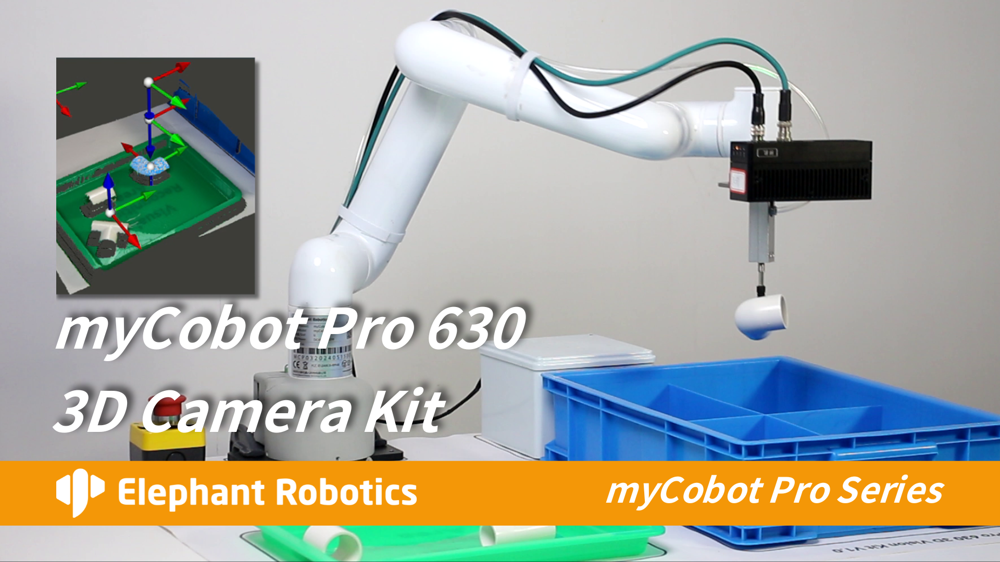

## 5 Case Reproduction

<!-- Refer to the capture demonstration section in the video tutorial: https://www.bilibili.com/video/BV1xxTNzxEL2/?spm_id_from=333.337.search-card.all.click&vd_source=672e3f7240eaaca210b45e7c033dc45f
**Video section time point**: 6 minutes 27 seconds to 6 minutes 55 seconds -->

<!-- **Notes**: Point cloud templates for the 4 types of PVC workpieces have already been created; users do not need to create them again and can use them directly. -->

## 5.1 Workpiece Placement
Place the PVC workpieces in the tray. Workpieces must be placed flat and not stacked.

## 5.2 Reproduction Steps

Double-click the RVS icon on your desktop. After RVS opens, click "Load".

Then select the demo.rvs file in the location_demo folder.

Then click "Run".

Wait for the camera to initialize.

 

**Important Notes**

After the program runs, once the camera returns to its shooting position, do not place workpieces into the tray midway through the process to avoid camera misidentification and potential collisions with the robotic arm.

<!-- ## 5.4 Important Notes

After the program runs, once the camera returns to its shooting position, do not place workpieces into the tray midway through the process to avoid camera misidentification and potential collisions with the robotic arm. -->

<!-- # 5.3 Explanation of Point Cloud Sampling Interval and Grabbing Time

In the Percipio3DMatching operator of RVS, modelRelSamplingDistance and sceneRelSamplingDistance are used to adjust the point cloud sampling interval during the template matching process. A smaller sampling interval increases the matching time, resulting in a longer time for complete recognition and grabbing of a single workpiece, but it can improve the workpiece recognition accuracy. Under normal circumstances, no adjustment is needed; you can use it directly. If adjustment is required, the adjustment values ​​for both parameters must be the same.

 -->

---

[← Previous Chapter](./hand_eye.md) | [Next Chapter →](./readme.md)