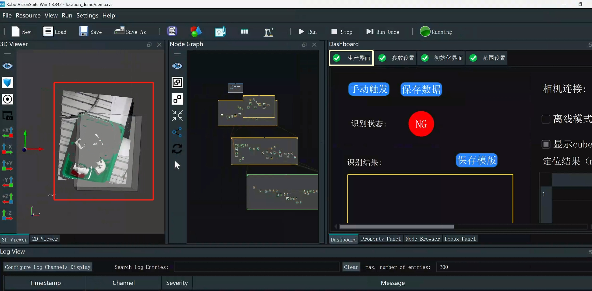
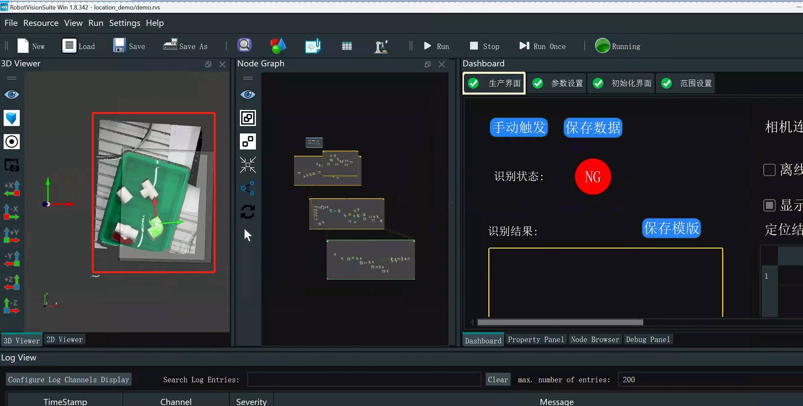

# 5 Exception handling

If there is a problem with point cloud imaging after running the case program, you need to use the camera parameter adjustment software to adjust it

Camera parameter adjustment software download address: https://en.percipio.xyz/downloadcenter/

For specific operations, please refer to the video, which can be downloaded to the local computer for viewing. The video address is: https://github.com/elephantrobotics/Pro3D_Kit/blob/mv/rvs_cam.mp4

Parameter adjustment reference

 

Point cloud after parameter adjustment

