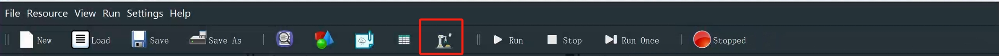
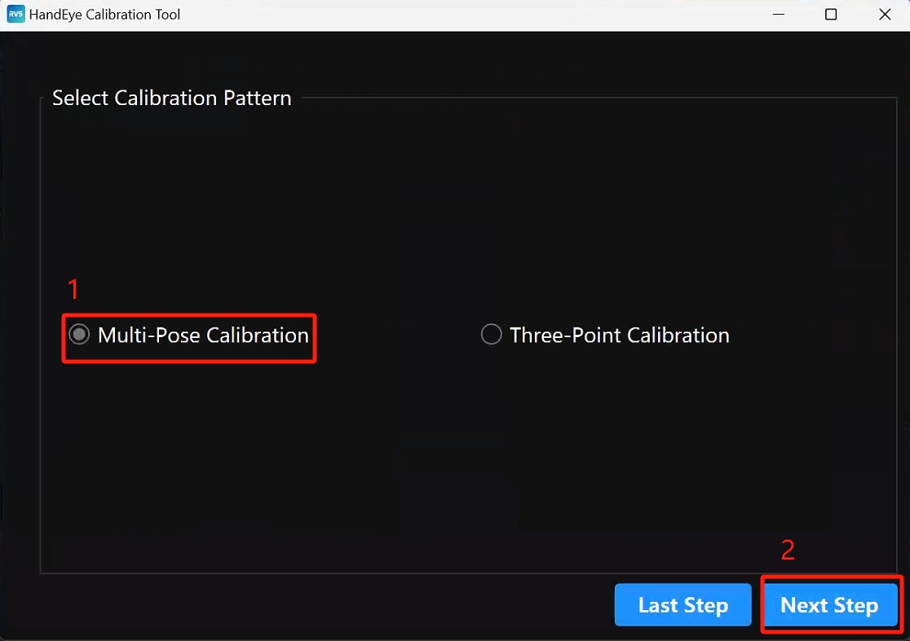
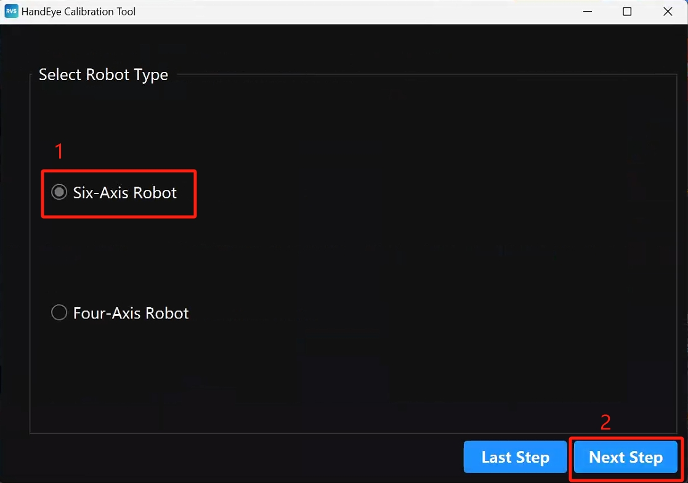
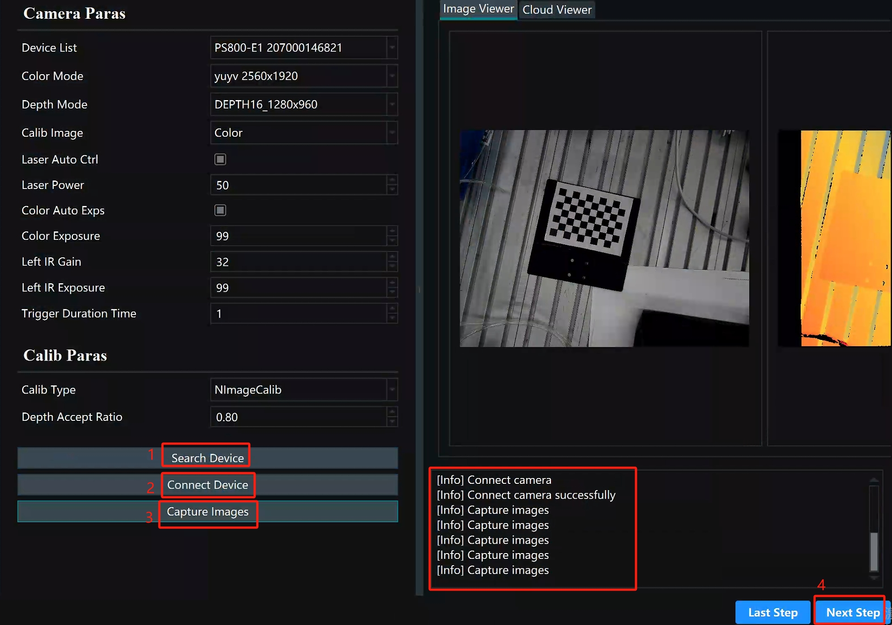
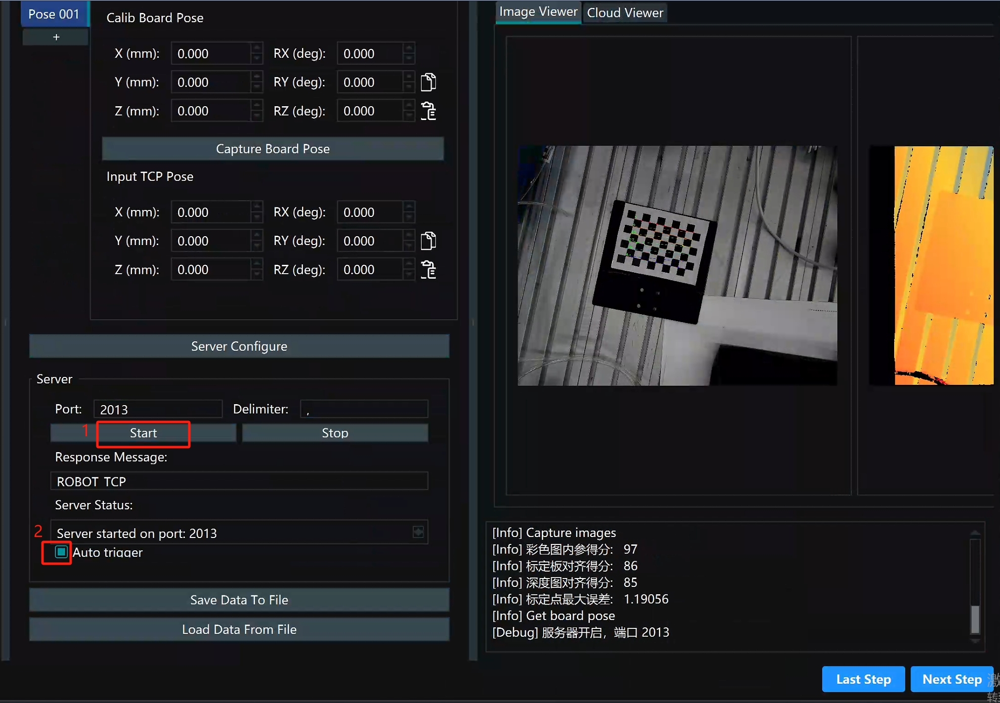
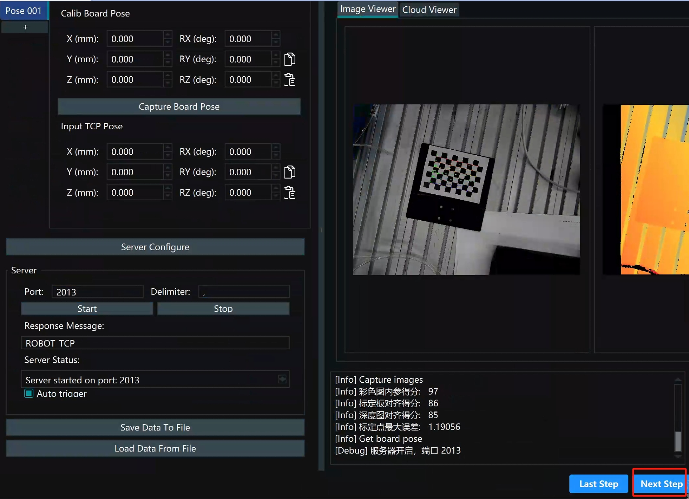
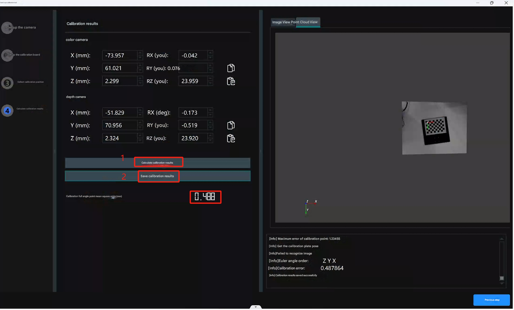
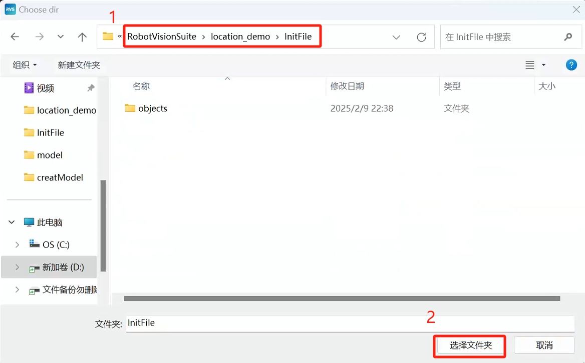

# 4 Hand-Eye Calibration

<!-- Refer to the hand-eye calibration section in the video tutorial: https://www.bilibili.com/video/BV1xxTNzxEL2/?spm_id_from=333.337.search-card.all.click&vd_source=672e3f7240eaaca210b45e7c033dc45f
**Video section time point**: 2 minutes 47 seconds to 4 minutes 10 seconds -->

<!-- Calibration board generation website: https://calib.io/pages/camera-calibration-pattern-generator
Set the parameters according to the image and print it out -->

**Friendly Reminder**: If the user strictly follows the hardware installation section to install the camera, the user can directly jump to the function reproduction section to reproduce the function. If the workpiece cannot be captured, then perform hand-eye calibration.

In the camera project, find the calibration board file and print it out.

<!--  -->

Double-click the RVS icon on your desktop. After RVS opens, click the Hand-Eye Calibration Tool in the menu bar to open the Hand-Eye Calibration Tool window.

Select "Eye on Hand" and click Next.

Select "Multi-pose Calibration" and click Next.

Select a six-axis robot and click Next.

Follow the installation image guide, click the buttons in sequence. After clicking each button and the log is output, proceed to the next step. Place the calibration plate in the center of the field of view to ensure the robotic arm can completely capture the calibration plate after each movement.

Enter the calibration plate spacing according to the side length of one grid on the calibration plate. Click "Recognize Calibration Plate," and after the score is output, click Next.

 

Following the image annotations, click the buttons in sequence.

Run the HandInEyeCailb.py file in the demo_code folder within the location_demo folder. Do not move the calibration board after running the program.

After the program finishes, click Next, then click Calculate Calibration Results. After the results are output, click Save Calibration Results and save them to the InitFile folder within the location_demo folder.

 

 

Finally, close the RVS software

---

[← Previous Chapter](./book3.md) | [Next Chapter →](./book4.md)